# Ranking giovanili italiani e transizione al professionismo

*Documento generato da `report/assembla.py` il 2026-09-28. Ogni numero viene da una query: non c'è nulla scritto a mano.*

| | |
|---|---|
| Popolazione | atleti con almeno un punto nel ranking nazionale di ciclismo.info |
| Coorti, accesso al professionismo | nati 1996-2000 |
| Coorti, qualità della carriera | nati 1992-2000 |
| Sesso | M |
| Ultima stagione | 2025 |
| Sezioni | sintesi, provenienza, misura, attrito, copertura, posti, passaggi, punteggi, rae, correlazioni, contesto, univariati, annidati, metriche, sopravvivenza, traiettorie, qualita, porta, ragazze, validazione |

> I risultati riguardano **gruppi, non persone**. Le celle con meno di 5 atleti sono mascherate: i dati riguardano minorenni.

---

## Indice

- [In sintesi](#in-sintesi)
  - [Cosa il rendimento giovanile predice](#cosa-il-rendimento-giovanile-predice)
  - [Cosa non predice, e cosa sembra predire senza farlo](#cosa-non-predice-e-cosa-sembra-predire-senza-farlo)
  - [Quanto sono solidi questi risultati](#quanto-sono-solidi-questi-risultati)
  - [Limiti](#limiti)
  - [Conclusione](#conclusione)
- [Da dove vengono i dati](#da-dove-vengono-i-dati)
- [Lo stesso punteggio è lo stesso risultato?](#lo-stesso-punteggio-è-lo-stesso-risultato)
  - [La nostra fonte conta le gare internazionali](#la-nostra-fonte-conta-le-gare-internazionali)
  - [Ma i pari merito sono moltissimi](#ma-i-pari-merito-sono-moltissimi)
- [Quanti restano](#quanti-restano)
  - [Quando si smette](#quando-si-smette)
  - [Uscire dalla classifica non è smettere](#uscire-dalla-classifica-non-è-smettere)
  - [Chi arriva in fondo](#chi-arriva-in-fondo)
- [Quanto del ciclismo giovanile si vede da qui](#quanto-del-ciclismo-giovanile-si-vede-da-qui)
  - [L'attrito della classifica e quello vero](#lattrito-della-classifica-e-quello-vero)
  - [Si possono stimare gli anni che mancano?](#si-possono-stimare-gli-anni-che-mancano)
- [Quanti posti ci sono, e chi se li prende](#quanti-posti-ci-sono-e-chi-se-li-prende)
  - [Ma il primo anno non sparisce per mancanza di posti](#ma-il-primo-anno-non-sparisce-per-mancanza-di-posti)
  - [Quanto sono concentrati i punti](#quanto-sono-concentrati-i-punti)
  - [Quanti posti c'erano prima](#quanti-posti-cerano-prima)
- [Il passaggio di categoria è una rottura?](#il-passaggio-di-categoria-è-una-rottura)
- [Chi è arrivato andava già meglio?](#chi-è-arrivato-andava-già-meglio)
  - [Il gradiente per livello raggiunto](#il-gradiente-per-livello-raggiunto)
- [L'effetto dell'età relativa](#leffetto-delletà-relativa)
  - [Chi entra nel ranking](#chi-entra-nel-ranking)
  - [Chi arriva, fra quelli entrati](#chi-arriva-fra-quelli-entrati)
  - [Lo stesso effetto sulle ragazze](#lo-stesso-effetto-sulle-ragazze)
- [Quanto si somigliano le categorie](#quanto-si-somigliano-le-categorie)
  - [Serve la penalizzazione?](#serve-la-penalizzazione)
- [Società, regione, mobilità](#società-regione-mobilità)
  - [Lo stesso confronto, a parità di carriera](#lo-stesso-confronto-a-parità-di-carriera)
  - [Cambiare società spesso non è una scelta](#cambiare-società-spesso-non-è-una-scelta)
  - [Regione e società di partenza](#regione-e-società-di-partenza)
- [Quanto vale il rendimento, misurato](#quanto-vale-il-rendimento-misurato)
  - [È rendimento, o è la data di nascita?](#è-rendimento-o-è-la-data-di-nascita)
  - [Perché la colonna «% pro» non va letta come un segnale](#perché-la-colonna--pro-non-va-letta-come-un-segnale)
- [Cosa aggiunge ogni categoria](#cosa-aggiunge-ogni-categoria)
- [Se il ranking si usasse per selezionare](#se-il-ranking-si-usasse-per-selezionare)
- [Quando si diventa professionisti](#quando-si-diventa-professionisti)
  - [Cosa sposta il rischio](#cosa-sposta-il-rischio)
- [Conta il livello o il miglioramento?](#conta-il-livello-o-il-miglioramento)
  - [La stessa risposta senza coefficienti](#la-stessa-risposta-senza-coefficienti)
  - [Non sarà di nuovo la durata della carriera?](#non-sarà-di-nuovo-la-durata-della-carriera)
- [Non solo se si arriva, ma fino a dove](#non-solo-se-si-arriva-ma-fino-a-dove)
  - [Dove il rendimento giovanile smette di contare](#dove-il-rendimento-giovanile-smette-di-contare)
  - [La catena delle probabilità](#la-catena-delle-probabilità)
- [Da quale porta si entra](#da-quale-porta-si-entra)
  - [Il test discriminante](#il-test-discriminante)
  - [Ma le due porte non portano allo stesso posto](#ma-le-due-porte-non-portano-allo-stesso-posto)
- [Le ragazze](#le-ragazze)
  - [Un cambio di regolamento che vale un esperimento](#un-cambio-di-regolamento-che-vale-un-esperimento)
  - [Le cose che non cambiano](#le-cose-che-non-cambiano)
- [Quanto regge tutto questo](#quanto-regge-tutto-questo)
  - [Quanti professionisti, e perché i conteggi non coincidono](#quanti-professionisti-e-perché-i-conteggi-non-coincidono)
  - [Il modello si sta giudicando troppo bene?](#il-modello-si-sta-giudicando-troppo-bene)
  - [Funziona su coorti che il modello non ha visto?](#funziona-su-coorti-che-il-modello-non-ha-visto)
  - [Le conclusioni dipendono dalle scelte di disegno?](#le-conclusioni-dipendono-dalle-scelte-di-disegno)
  - [Un modello più complicato farebbe meglio?](#un-modello-più-complicato-farebbe-meglio)
  - [E se si usassero tutte le categorie insieme?](#e-se-si-usassero-tutte-le-categorie-insieme)

---

## In sintesi

**Contesto.** La letteratura sulla transizione dal ciclismo giovanile al professionismo parte dall'Under 17 e trova che il rendimento diventa informativo avvicinandosi all'esito. Nessuno ha mai verificato se il risultato agonistico a tredici-quattordici anni predica l'accesso al professionismo su una popolazione ampia e non preselezionata — che è però l'età in cui si prendono le prime decisioni di selezione.

**Obiettivo.** Misurare da che età il piazzamento nelle classifiche giovanili italiane informa sull'accesso al professionismo, quanto informa, e cosa significherebbe usarlo per selezionare.

**Dati.** Classifiche nazionali giovanili italiane, stagioni 2007-2025: 28 037 piazzamenti stagionali di 11 094 atleti, con la data di nascita osservata per il 99,8% di loro. Gli esiti di carriera vengono da ProCyclingStats, abbinati su nome e data di nascita. Le coorti principali sono i nati 1996-2000: **2 813 atleti, 77 professionisti** (— per mille di chi era in classifica da Under 15).

**Di chi si parla, e questo è già un risultato.** Comparire in classifica richiede almeno un piazzamento nei primi cinque in una gara, e vi compare **circa un tesserato su 7** (media 15,0%, stabile fra quattro categorie e le stagioni 2018-2025). Ogni percentuale di questo studio ha quindi come denominatore un gruppo già selezionato, non l'insieme dei tesserati.

**Metodi.** Il predittore è il percentile entro cella `stagione x categoria x anno di categoria`. Regressione logistica con correzione di Firth per gli eventi rari; modelli annidati sullo stesso sottocampione con test di DeLong; modello di sopravvivenza a tempo discreto con legame cloglog ed errori standard raggruppati per atleta; modello misto per le traiettorie individuali; regressione ordinale per il livello di carriera raggiunto. Nessuna selezione automatica delle variabili: i modelli sono specificati dalla domanda.

### Cosa il rendimento giovanile predice

**Predice, e da subito.** Già al primo anno di Under 15 la separazione fra chi arriverà e chi no è appena sopra il confine convenzionale fra «medio» e «grande» (delta di Cliff 0,470). Il peso cresce con l'età: dieci punti di percentile moltiplicano l'odds di diventare professionista per 1,40 in U15y1 e per 2,28 in U19y2.

**Fra gli atleti osservati in tutte le categorie, l'informazione si concentra nell'ultima misura disponibile.** Costruendo i modelli per aggiunte successive sugli stessi 102 atleti, il salto maggiore è **M3 (+U19y2)** (ΔAUC +0,151). Tre metodi concordano, e due dei tre girano su quasi lo stesso sottocampione: i modelli annidati, una foresta casuale con quindici predittori in più (che guadagna +0,020 di AUC) e una regressione penalizzata su tutte le categorie insieme, che ne trattiene solo le due più vicine all'esito.

**Il livello è una condizione, il miglioramento un moltiplicatore.** Separando la traiettoria individuale in livello e pendenza, entrambi contano e la pendenza aggiunge informazione: l'AUC passa da 0,848 a 0,919 (p < 0,001). Fra gli atleti di livello alto, chi stava anche migliorando è arrivato al professionismo dieci volte più spesso di chi stava peggiorando; ma nel terzo di livello più basso il miglioramento non basta quasi mai.

**Il passaggio ha una finestra stretta.** Nessuno diventa professionista prima dei 19 anni — è una regola, non un dato — e il rischio è massimo a 23. Per un atleta che resta in classifica ogni stagione, la probabilità di arrivare al professionismo vale 11,1% con rendimento medio e 30,9% con venti punti di percentile in più.

### Cosa non predice, e cosa sembra predire senza farlo

**Predire non è selezionare.** Selezionando il 10% migliore della classifica U19y2 si intercetta il **59% dei futuri professionisti**, ma il **52% dei selezionati non lo diventerà**. Con un esito che riguarda meno del 3% della coorte, anche un ordinamento accurato produce in maggioranza falsi positivi: è aritmetica della base, non un difetto del criterio.

**Predice l'ingresso, non la profondità della carriera.** Sulla scala a quattro livelli il rendimento Under 19 moltiplica per 2,50 l'odds di salire di gradino (IC 95% 2,15-2,90). Ma scomponendo il percorso in stadi successivi, il coefficiente vale 2,47 per diventare professionista e scende a valori il cui intervallo di confidenza comprende l'uno per entrare nel top 500 fra i professionisti e nel top 100 fra i top 500: sui gradini successivi l'associazione non è distinguibile dal caso, che non è la stessa cosa che averne dimostrata l'assenza. Una parte della spiegazione è che la soglia non sia una sola: fra i professionisti presenti in classifica a diciotto anni, il 60% debutta in una squadra a maggioranza italiana, e di questi arriva nel top 500 il 33% contro il 59% di chi debutta in una squadra straniera, mentre il rendimento giovanile predice le due porte allo stesso modo.

**Uscire dalla classifica non è smettere.** Il **30,6%** degli atleti salta almeno una stagione e poi ricompare, e metà dei classificati al secondo anno di Allievi non c'era al primo. Il crollo apparente al cambio di categoria — resta il 32,4% contro il 80,0% dei passaggi interni — non viene dalla scarsità dei posti ma dalla concorrenza fra annate: la classifica di arrivo è composta per il 88,2% da chi c'era già, contro il 60,7% dei passaggi interni. Il confronto con i tesserati federali conferma dall'esterno che la classifica non si restringe più in fretta della popolazione che la genera.

**L'effetto dell'età relativa è di accesso, non di talento.** Rispetto all'atteso demografico italiano — non all'uniforme — i nati nel primo trimestre sono **2,13 volte** i nati nel quarto in U15, e il vantaggio si spegne a **1,09** in U23. Fra chi arriva al professionismo il rapporto è 1,47, contro 1,73 di tutti i classificati, e non si distingue dal caso (p 0,12): su 77 atleti è un indizio più che una prova. Chi seleziona presto premia la maturità anagrafica, e quel vantaggio non si converte in carriera. I modelli lo confermano dall'altro lato: aggiungere l'età relativa non sposta il coefficiente del percentile in nessuna cella (l'AUC si muove al massimo di 0,007), e da sola l'età relativa arriva a un'AUC di 0,513.

**Società, mobilità e regione non aggiungono nulla di leggibile.** Il gradiente della mobilità sembra enorme — dal 0,68% al 7,32% di professionisti secondo il numero di cambi di società — ma a parità di stagioni corse quasi sparisce. E il **96,3%** cambia società passando dagli Juniores all'Under 23, contro circa il 21% dei passaggi interni a una categoria: è organizzazione dello sport, non una decisione. La società di partenza va dal 2,90% al 3,79%, la regione non mostra differenze leggibili.

**Il primo anno di categoria non sparisce per mancanza di posti.** Dove ogni annata ha la propria classifica il primo anno ne vince il 49,7%, dove la lista è unica e le gare sono le stesse il 26,7%: è concorrenza, non scarsità. I posti però calano davvero salendo di categoria, da 639 classificazioni di gara per stagione in Esordienti a 146 in Under 23, e calano anche nel tempo, con una perdita del 58,3% fra la prima e l'ultima stagione osservata. La concentrazione dei punti invece non cambia mai: il decile migliore ne prende fra il 36,7% e il 43,2% a ogni età.

**Sul femminile si è potuto misurare ciò che non richiede un esito.** Dove il conteggio è confrontabile, il movimento corre fra 6,4 e 8,1 volte meno gare di quello maschile, e non ha una classifica Under 23. L'effetto dell'età relativa è più debole che fra i maschi a tredici anni, 1,51 contro 1,98 sulle stesse coorti, coerente con una maturazione più precoce. E un cambio di regolamento della fonte conferma il meccanismo dei posti: separando le classifiche delle Esordienti nel 2022, la quota del primo anno è passata dal 28,5% al 49,6%, nella stessa categoria e alle stesse età.

### Quanto sono solidi questi risultati

L'ottimismo dei modelli, stimato con 500 ricampionamenti bootstrap, è al massimo di 0,001 punti di AUC contro una soglia di allarme di 0,05, e le pendenze di calibrazione sono a ridosso di 1. Addestrando sulle coorti più vecchie e verificando sulle più recenti la capacità discriminante non cala. Cambiando la definizione di professionista gli eventi passano da ventisei a centocinquantuno, ma l'AUC oscilla di 0,069 in tutto; spostare la finestra d'età da ventiquattro a ventisei anni non cambia praticamente nulla. Il fattore di inflazione della varianza massimo è 2,89, sotto la soglia di 5: le categorie portano informazione abbastanza distinta da poter essere usate insieme. Le AUC dei modelli univariati coincidono con quelle ricavate dal delta di Cliff per via puramente descrittiva entro 0,0008: due strade indipendenti per la stessa quantità.

### Limiti

**Il limite principale è cosa la fonte non contiene.** Nessuna delle fonti pubblica altezza, peso, specialità, volume di allenamento o numero di gare disputate: di ogni atleta si conosce il piazzamento, non come ci sia arrivato. Ogni conclusione vale **a parità di ciò che la classifica registra**, che è meno di ciò che un allenatore vede.

Il livello di carriera più alto poggia su pochi casi, e sugli stadi successivi al professionismo si può dire che **non si vede** un effetto, non che non ci sia. Il denominatore dei tesserati esiste solo dal 2018 e non è disponibile per regione, il che lascia aperta l'unica domanda geografica che varrebbe la pena porre. La parte predittiva dello studio riguarda i **maschi**: sul femminile si è misurato tutto ciò che non richiede un esito di carriera, ma l'esito stesso non è confrontabile, perché le divisioni professionistiche femminili nascono nel 2020 e prima esisteva una categoria sola.

### Conclusione

Il risultato agonistico a tredici anni **non è rumore**: separa già in modo marcato chi arriverà al professionismo da chi no, e la separazione cresce fino all'Under 19, dove si concentra quasi tutta l'informazione utile. Ma la stessa misura che predice bene **seleziona male**: qualunque soglia si scelga, la maggioranza dei selezionati non diventerà professionista, e la maggior parte di chi esce dalla classifica non ha smesso di correre.

La lettura pratica non riguarda i ragazzi ma chi li guarda: la classifica giovanile è uno strumento ragionevole per decidere **chi seguire**, e uno strumento pessimo per decidere chi lasciare andare.

## Da dove vengono i dati

Ogni numero di questo documento nasce da due fonti pubbliche, unite da una terza operazione — riconoscere che un ragazzo in una classifica giovanile italiana e un corridore in un archivio internazionale sono la stessa persona. Vale la pena descrivere tutte e tre, perché i limiti dei risultati vengono quasi tutti da qui.

| cosa | fonte | quanto |
|---|---|---|
| classifiche giovanili italiane | ciclismo.info, stagioni 2007-2025 | 28 037 righe di classifica, 11 094 atleti |
| date di nascita | schede personali su ciclismo.info | 10 544 date complete; 11 075 anni di nascita osservati anziché dedotti |
| esiti di carriera | ProCyclingStats, classifiche 2007-2026 | 727 atleti abbinati |
| nascite attese per trimestre | Eurostat, tavola `demo_fmonth` | serve solo all'effetto dell'età relativa |
| tesserati per categoria | Federazione Ciclistica Italiana, dati statistici pubblicati | serve a dare scala alle percentuali |

**Le classifiche giovanili** sono quelle che ciclismo.info pubblica per ogni stagione e per ogni categoria. Non sono state raccolte per questo studio: derivano da un progetto separato che ne mantiene lo scaricamento e il database ([risultati-ciclismo-giovanile](https://github.com/lucabnt/risultati-ciclismo-giovanile)), e questo documento lavora sull'estrazione del 2026-08-10, schema `2.1`. Tenere separate le due cose ha un motivo pratico — la raccolta si aggiorna con un ritmo suo, l'analisi si rigenera quando serve — e uno di onestà: chi vuole controllare i dati di partenza guarda quel repository, non questo.

Va detto che cosa quella fonte non è: **non è l'archivio ufficiale della federazione**, ma un portale che raccoglie e ordina i risultati per conto proprio. Le classifiche che pubblica sono l'unico archivio giovanile italiano consultabile per stagione e per categoria, e la verifica della struttura delle liste e del sistema a punti sta in `docs/verifica_dati_giovanile.md`, ma un errore di trascrizione a monte non sarebbe visibile da qui. Il percentile attenua il problema, perché un punteggio sbagliato sposta un atleta di qualche posizione e non cambia l'ordine generale, e non lo azzera.

**Le date di nascita** vengono dalle schede personali dello stesso portale, scaricate a parte. Servono all'effetto dell'età relativa, che senza il giorno esatto non si può misurare. La copertura è quasi totale — 11 075 anni di nascita su 11 094 sono letti da una scheda e non dedotti — e questo conta, perché dove la scheda manca l'anno si ricostruirebbe dalla categoria e dalla stagione, che è inferenza e non osservazione. Le due cose restano distinte in tutto il progetto. 18 date sono state corrette a mano dopo aver trovato incoerenze fra la scheda e le classifiche, e le correzioni sono registrate una per una.

**Gli esiti di carriera** vengono da ProCyclingStats: rose delle squadre professionistiche stagione per stagione, da cui si ricava chi è passato professionista e quando, e classifiche mondiali annuali, da cui si ricava fin dove è arrivato. L'abbinamento fra i due archivi è fatto su nome e data di nascita, con quattro passaggi di precisione decrescente; i casi ambigui sono stati risolti a mano guardando **solo** nome e data, mai la carriera, e registrati uno per uno.

Quanto regge quel collegamento è una domanda legittima, e la risposta è questa: dei 727 abbinamenti **707 sono esatti su nome più data di nascita completa**, e due persone diverse con lo stesso nome normalizzato e la stessa data al giorno sono un'eventualità trascurabile. I restanti 20 sono stati guardati uno per uno, e al termine della verifica **nessun abbinamento resta ambiguo**. La stessa verifica ha corretto 18 date di nascita: le due fonti non sempre concordano, e caso per caso ha avuto ragione ora l'una ora l'altra, quindi nessuna regola automatica avrebbe funzionato.

> **Cosa non c'è, ed è il limite principale.** Nessuna delle fonti pubblica altezza, peso, specialità, volume di allenamento o numero di gare disputate. Di ogni atleta si sa il piazzamento, non come ci è arrivato. Ogni conclusione di questo documento va quindi letta come **«a parità di ciò che la classifica registra»**, che è meno di ciò che un allenatore vede.

> In particolare il percentile non sa quante gare ha corso un atleta: chi ne ha corse dieci e chi una sola possono trovarsi allo stesso posto in classifica, e il primo ha avuto dieci occasioni di andare a punti. I risultati valgono quindi a parità di esposizione alla gara, che nei dati non c'è.

> Non c'è nemmeno l'elenco dei tesserati per regione, il che lascia aperta l'unica domanda geografica che varrebbe la pena porre.

> I dati riguardano minorenni e nel repository non entra nulla che permetta di risalire a una persona: gli identificativi sono cifrati con un segreto tenuto fuori dal codice, e nessuna tabella pubblicata contiene celle con meno di cinque atleti.

## Lo stesso punteggio è lo stesso risultato?

Tutto quello che segue si appoggia a una misura: il piazzamento nella classifica nazionale. Prima di usarla conviene chiedersi quanto sia precisa, e la domanda non è oziosa — arriva da fuori.

> **Come si misura — La critica di Hasselaar, e perché va presa sul serio**
>
> Uno studio olandese del 2025 ha mostrato il problema con un esempio che vale più di qualunque argomento. Due ciclisti, uno che corre gare internazionali e uno che corre soprattutto gare locali, ottengono **lo stesso identico punteggio** nel ranking federale: 414 punti. In una metrica costruita apposta per tenere conto del livello delle gare, gli stessi due valgono 76 e 21, cioè un fattore 3,6. I due ciclisti sono **costruiti dagli autori**, non due casi osservati, e vanno citati come tali: il meccanismo che illustrano è però reale e documentato nello stesso articolo.
>
> La ragione è che il ranking olandese non conta i risultati internazionali, quindi assegna zero punti proprio alle gare più difficili. E premia chi va bene nelle tipologie di gara più frequenti in calendario: in Olanda i circuiti piatti e ventosi, dove i velocisti hanno molte più occasioni degli scalatori.
>
> La critica colpisce direttamente la fonte di questo studio, che è un ranking federale. Va quindi verificata sui dati invece che accettata o respinta.
>
> Approfondimenti: [Hasselaar & Elferink-Gemser (2025)](https://doi.org/10.36950/2025.10ciss012)

### La nostra fonte conta le gare internazionali

La prima metà della critica non si applica. La classifica italiana **pesa le gare per livello**, ma solo dalle categorie internazionali in su. I regolamenti della fonte, che sono pubblici, danno la scala esatta:

| tipo di gara | Esordienti e Allievi | Juniores (e Under 23) |
|---|---|---|
| regionale | 5-4-3-2-1 | 5-4-3-2-1 |
| nazionale | 5-4-3-2-1 | 10-8-6-4-2 |
| internazionale | non in calendario | 15-12-9-6-3 |
| campionato italiano in linea | 15-12-9-6-3 | 15-12-9-6-3 |
| campionato italiano a cronometro | 15-12-9-6-3, ma solo Allievi | 15-12-9-6-3 |
| campionato europeo | non in calendario | 20-16-12-8-4 |
| campionato del mondo | non in calendario | 30-24-18-12-6 |

*punti dal primo al quinto arrivato. Il campionato italiano a cronometro Esordienti non si disputa, quindi per quella categoria la riga è lettera morta. Il regolamento Under 23 non è stato reperito: qui si assume che ricalchi quello Juniores, come categoria internazionale, e l'assunzione va tenuta presente*

In Esordienti e Allievi, quindi, la scala è piatta salvo i campionati italiani, che valgono il triplo: due in Allievi, la gara in linea e quella a cronometro, e **uno solo in Esordienti**, perché il campionato a cronometro per quella categoria non si disputa. Il regolamento della fonte lo elenca lo stesso, ricalcando il fascicolo degli Allievi, ma è lettera morta. Per il resto, a quelle età una gara all'estero vale quanto una gara sotto casa. Dagli Juniores in su i moltiplicatori compaiono, e sono più di due — il campionato europeo vale quattro volte una gara regionale e quello del mondo sei.

Non abbiamo il dettaglio delle singole gare, ma la conseguenza si vede lo stesso: se le gare pesano, un piazzamento vale in media di più. Basta dividere i punti per il numero di piazzamenti nei primi cinque.

| categoria | osservazioni | punti medi | piazzamenti medi | punti per piazzamento |
|---|---|---|---|---|
| U15 | 3464 | 16,3 | 5,39 | 2,67 |
| U17 | 2529 | 12,5 | 4,14 | 2,73 |
| U19 | 1602 | 15,6 | 4,28 | 3,02 |
| U23 | 706 | 19,0 | 3,91 | 4,17 |

*la scala della tabella precedente si applica a ogni piazzamento: in Esordienti e Allievi è piatta salvo i due campionati italiani, dagli Juniores in su cresce con il livello della gara*

**Il salto è esattamente dove deve essere.** Un piazzamento vale 2,67 punti in U15 e 4,17 in U23, e la crescita comincia fra Allievi e Juniores — cioè dove i moltiplicatori entrano in funzione. È una conferma indiretta ma pulita: la scala fa quello che dichiara di fare.

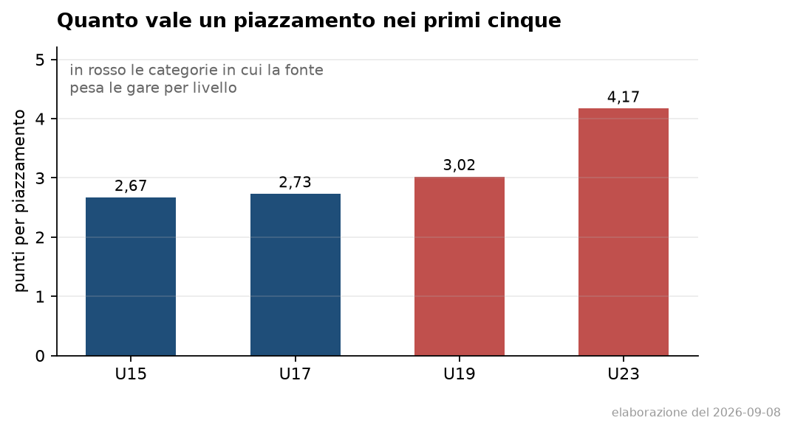

*Il salto avviene fra Allievi e Juniores, che è esattamente dove la fonte comincia a moltiplicare i punti delle gare nazionali e internazionali.*

> **Come si misura — Cosa entra in classifica, e cosa no**
>
> I regolamenti della fonte delimitano la popolazione e il calendario in modo più stretto di quanto si direbbe, e ognuno dei quattro limiti che seguono lascia un segno nei dati.
>
> **Solo strada.** Contano le gare su strada, in circuito e a cronometro, di qualunque lunghezza; le gare su pista sono escluse per regolamento. Chi corre altre specialità è tesserato ma non può comparire, ed è una delle ragioni per cui la copertura calcolata più avanti è un limite inferiore.
>
> **Solo tesserati con società italiane.** Chi è tesserato per una società affiliata all'estero non entra in classifica nemmeno quando ottiene risultati in gare che si corrono in Italia. Un atleta che passa a una squadra straniera esce quindi dalla classifica senza aver smesso di correre, ed è un meccanismo in più fra quelli che fanno sparire un nome.
>
> **I risultati all'estero li segnala l'atleta.** Il regolamento chiede a chi corre fuori dall'Italia di far pervenire copia dell'ordine di arrivo perché il risultato venga conteggiato. Le gare internazionali sono quindi incluse, ma per iniziativa del corridore: è ragionevole che a segnalarle siano soprattutto quelli che ci vanno spesso e che ne ricavano punti pesanti.
>
> **Anche in Italia la raccolta è a impegno di mezzi.** Il comitato dichiara che farà il possibile per conoscere tutti i risultati e che segnalerà le gare mancanti al momento della pubblicazione. Non è un archivio ufficiale della federazione, ed è bene ricordarlo ogni volta che si legge un'assenza come un'informazione.

### Ma i pari merito sono moltissimi

Resta un problema diverso, e più grande di quanto sembri. La scala assegna cinque punti alla vittoria e uno al quinto posto, quindi i totali possibili sono pochi e gli atleti tanti: **fino al 94,7% dei classificati condivide il proprio punteggio con qualcun altro**. Guardando solo i punti, quegli atleti sono indistinguibili.

Il progetto lo aveva previsto e aveva scelto di scioglierli guardando prima le vittorie, poi i secondi posti e così via fino al quinto. La scelta è registrata in `docs/definizioni.md` fin dal primo commit del repository ed è stata presa **prima di guardare qualunque esito**, il che permette ora di metterla alla prova senza il sospetto di averla scelta perché funzionava. Quest'ultima parte è una dichiarazione e non una prova: del lavoro precedente al repository non resta traccia.

C'è di più, ed è emerso dopo: quel criterio non è una nostra invenzione ma **la regola di spareggio che il regolamento della fonte dichiara**, nelle stesse parole e nello stesso ordine. Ricostruendo il percentile con esso non stiamo quindi imponendo un ordinamento nostro, stiamo riproducendo quello pubblicato. Il regolamento prosegue con due criteri ulteriori che qui non si applicano: a parità anche di piazzamenti vince chi ha raggiunto per primo il punteggio, e in ultimo il più giovane. Il primo chiederebbe la data di ogni gara, che non abbiamo; il secondo introdurrebbe l'età dentro la misura, che è esattamente ciò che non vogliamo. Chi resta a pari merito qui ha lo stesso identico palmares, e la tabella qui sotto mostra che spingersi oltre non servirebbe.

| cella | atleti | professionisti | pari merito | AUC sui punti | AUC con il criterio esteso | differenza | p |
|---|---|---|---|---|---|---|---|
| U15y1 | 1678 | 59 | 92,7% | 0,737 | 0,735 | -0,002 | 0,246 |
| U15y2 | 1786 | 63 | 94,7% | 0,786 | 0,786 | +0,000 | 0,935 |
| U17y1 | 927 | 62 | 93,9% | 0,812 | 0,814 | +0,002 | 0,340 |
| U17y2 | 1602 | 72 | 94,1% | 0,859 | 0,858 | -0,001 | 0,418 |
| U19y1 | 701 | 68 | 88,9% | 0,807 | 0,806 | -0,001 | 0,796 |
| U19y2 | 901 | 74 | 87,5% | 0,889 | 0,889 | +0,001 | 0,402 |
| U23y1 | 137 | 51 | 65,7% | 0,711 | 0,699 | -0,011 | 0,161 |

*le due misure sono calcolate sugli stessi atleti: il confronto è appaiato, e il test di DeLong ne tiene conto*

**Non cambia niente.** Il guadagno più grande è di 0,002 punti di AUC, in 4 celle su 7 la differenza è addirittura negativa, e in nessuna cella è distinguibile dal caso. A parità di punti, **il modo in cui sono stati ottenuti non dice nulla di più** su chi diventerà professionista.

È un risultato controintuitivo e vale la pena soffermarsi. Cinque punti si ottengono con una vittoria oppure con cinque quinti posti, e chiunque direbbe che la vittoria vale di più. Su questi dati non è così: i due atleti hanno le stesse probabilità di arrivare. Quello che conta è **quanto si è andati a punti**, non con quale forma.

> **Cosa se ne ricava per lo studio.** Il criterio esteso resta il predittore principale, perché è più fine e non fa danno; ma la sezione dice esplicitamente che i risultati sarebbero gli stessi con i soli punti. È una verifica di robustezza su una scelta metodologica presa all'inizio, con l'esito che rende la scelta irrilevante — che è il modo migliore in cui una verifica del genere possa finire.

> **La parte della critica che resta in piedi.** Hasselaar solleva due problemi e qui se ne è affrontato uno solo. Il secondo — che un ranking premia chi eccelle nelle tipologie di gara più frequenti in calendario — **vale anche per i nostri dati e non è correggibile con quello che abbiamo**: servirebbe il dettaglio gara per gara, che la fonte non pubblica. Chi va forte in salita, in un calendario fatto soprattutto di percorsi veloci, ha meno occasioni di andare a punti. È un limite dello strumento, e va tenuto presente ogni volta che si legge un percentile come se fosse una misura del valore dell'atleta.

## Quanti restano

Prima di chiedersi se il risultato a tredici anni predica qualcosa, conviene sapere quanti di quei ragazzi si ritrovano dopo. La risposta inquadra tutto il resto: **la maggior parte dell'abbandono avviene molto prima del punto in cui la prestazione diventa predittiva**.

Su 2 813 atleti delle coorti 1996-2000, 77 sono arrivati al professionismo: **27,4 su mille**. Fra i soli 2 183 che erano in classifica già da Under 15 il tasso è un po' più alto, 30,2 su mille, perché 11 professionisti su 77 in Under 15 non c'erano: sono entrati nel ranking più tardi. I due tassi rispondono a due domande diverse, e vanno tenuti separati.

> **Chi è «in classifica».** La fonte assegna punti solo ai primi cinque di ogni gara: cinque alla vittoria, uno al quinto posto. Comparire nel ranking con un solo punto significa quindi **essere arrivati almeno una volta nei primi cinque** in quella stagione, e infatti il 100% delle 28 037 righe di classifica ha almeno un piazzamento nei primi cinque.
>
> Tutte le percentuali di questo documento hanno quindi come denominatore un gruppo **già selezionato**, non l'insieme dei tesserati: rispetto a tutti i ragazzi che corrono, le quote qui riportate sono sovrastime. La sezione successiva quantifica di quanto — circa un tesserato su sette compare in classifica.

> **Come si misura — Come si legge l'imbuto**
>
> «Presente in una categoria» significa aver ottenuto almeno un punto in almeno una delle sue stagioni. Le due colonne centrali rispondono a domande diverse: la prima conta chi era già in Under 15 ed è arrivato fin lì; la seconda conta chi era nella categoria immediatamente precedente.
>
> Divergono perché l'insieme non è una catena di sottoinsiemi: si entra anche tardi. L'ultima colonna quantifica proprio questo.
>
> Nessuna delle tre è un tasso di abbandono dello sport, per la ragione spiegata più avanti.

| categoria | atleti | % di chi era in U15 | % del livello precedente | % mai visti in U15 |
|---|---|---|---|---|
| U15 | 2183 | 100,0 | — | 0,0 |
| U17 | 1741 | 59,7 | 59,7 | 25,2 |
| U19 | 1051 | 34,1 | 51,2 | 29,1 |
| U23 | 342 | 10,3 | 26,7 | 34,5 |

Le due colonne centrali dicono cose diverse, e la differenza conta. L'imbuto **non è una catena di sottoinsiemi**: fra un quarto e un terzo degli atleti di ogni categoria non compare mai in Under 15. Sono ragazzi che entrano nel ranking più tardi, e che una lettura ingenua dell'imbuto conterebbe come "sopravvissuti" senza che siano mai partiti.

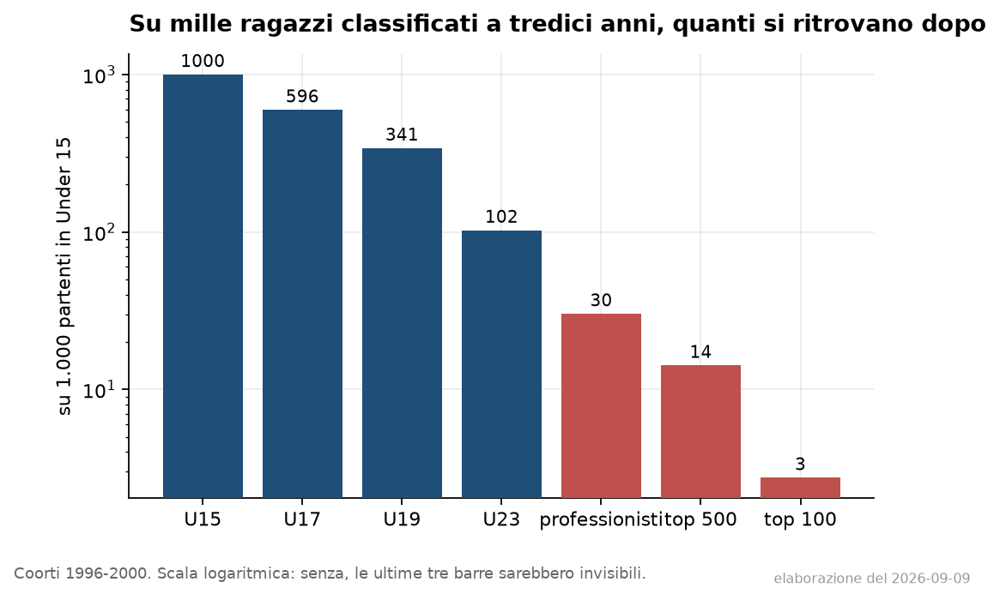

*L'attrito non è graduale, ma non è neanche l'abisso che si racconta: fra i mille classificati in Under 15 e i 30 che diventano professionisti c'è un fattore 33, non i tre ordini di grandezza che verrebbe da dire guardando il grafico.*

### Quando si smette

| categoria | età | escono nella categoria | escono all'ultimo anno | % all'ultimo anno |
|---|---|---|---|---|
| U15 | 13-14 | 837 | 551 | 65,8 |
| U17 | 15-16 | 837 | 713 | 85,2 |
| U19 | 17-18 | 752 | 611 | 81,2 |
| U23 | 19-22 | 252 | 79 | 31,3 |

*l'ultimo anno di categoria è quello in cui si è costretti a cambiare fascia*

Il **77,3%** di chi esce lo fa nell'ultimo anno della propria categoria. Non si smette perché si va male a metà percorso: si smette al passaggio di fascia, quando cambiano distanze, avversari e squadra.

Il passaggio di categoria si comporta quindi come una **discontinuità e non come una tappa**: se la crescita fosse continua e la classifica ne fosse una misura fedele, le uscite si distribuirebbero lungo tutto il percorso. Cosa esattamente si rompa in quel punto è un'altra domanda, e la sezione «Il passaggio di categoria è una rottura?» la affronta: l'anticipazione è che a cambiare bruscamente sia soprattutto **quanti posti ci sono in classifica**, non il rendimento di chi li occupava.

È un fatto operativo, non statistico: indica *quando* un intervento di ritenzione avrebbe senso, e mette in guardia dal leggere l'uscita come un giudizio sull'atleta.

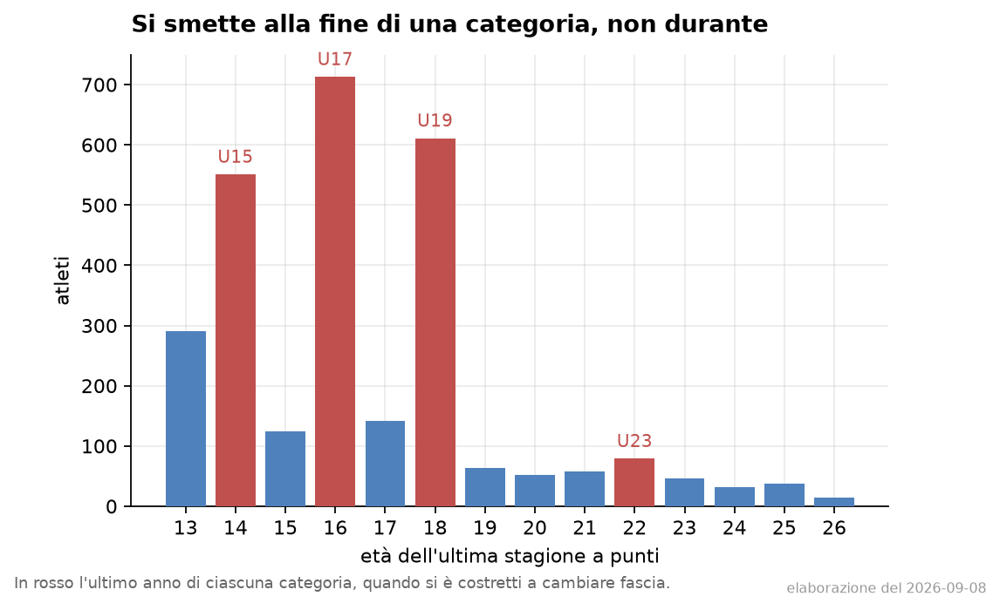

*L'uscita si concentra nell'anno in cui la categoria finisce: il passaggio di fascia è, più del rendimento, il momento in cui si decide se continuare.*

### Uscire dalla classifica non è smettere

Le tabelle qui sopra vanno lette con una cautela che non è una postilla: **sparire dalla classifica significa smettere di fare punti, non smettere di correre**. Un ragazzo che passa di categoria si trova contro avversari di un anno o due più grandi, e può benissimo continuare a correre senza più entrare a punti. Nella classifica quello è indistinguibile da chi ha appeso la bici al chiodo.

Non è una possibilità teorica: si misura. Il **30,6%** degli atleti salta almeno una stagione e poi **ricompare**, e il 6,7% torna dopo un'assenza di due stagioni o più. Se l'assenza fosse abbandono, non ci sarebbero rientri.

> **Come si misura — Le due misure del ricambio**
>
> La prima conta gli atleti la cui sequenza di stagioni ha un buco: presenti, assenti per una o più stagioni, presenti di nuovo. Un rientro dimostra che l'assenza non era un abbandono.
>
> La seconda confronta due liste consecutive della stessa categoria e conta quanti nomi sono nuovi. Misura il rinnovo della composizione senza dipendere dalle carriere individuali.
>
> Sono indipendenti fra loro e portano alla stessa conclusione, che è il motivo per cui vengono riportate entrambe.

| cella | atleti | non c'erano l'anno prima | % |
|---|---|---|---|
| U15y2 | 1786 | 505 | 28,3 |
| U17y2 | 1602 | 814 | 50,8 |
| U19y2 | 901 | 350 | 38,8 |

*dentro la stessa categoria, fra primo e secondo anno*

Il ricambio è così forte che **metà dei classificati al secondo anno di Allievi non c'era al primo**, e non hanno cambiato categoria: è la stessa fascia, un anno dopo. Quello che l'imbuto misura, quindi, non è quanti ragazzi lasciano il ciclismo, ma **quanto è mobile l'insieme di chi va a punti** — che è una cosa diversa, e per certi versi più interessante: dice che essere fuori dalla classifica a sedici anni non è una condanna.

### Chi arriva in fondo

I tre esiti hanno una **finestra temporale**, e senza di essa non si leggono. «Professionista» significa aver corso in una squadra di primo o secondo livello **entro i 25 anni**; il top 500 e il top 100 sono la migliore posizione nel ranking mondiale annuale **entro i 26**. Chi debutta più tardi, o migliora dopo, qui non risulta: è una scelta deliberata, perché una finestra aperta renderebbe le coorti recenti incomparabili con quelle vecchie.

Le due finestre non coincidono, e la ragione è che i due esiti hanno tempi diversi: al professionismo si arriva, mentre nel ranking mondiale si sale, e salire richiede almeno una stagione già corsa da professionista. Dare a entrambe la stessa finestra vorrebbe dire o tagliare fuori chi entra tardi nella classifica mondiale, o allargare quella del professionismo senza motivo. La sensibilità mostra comunque che questa scelta pesa pochissimo.

| esito | atleti | veniva dall'U15 | % dei 2 187 partenti in U15 |
|---|---|---|---|
| professionisti | 77 | 66 | 3,02 |
| top 500 | 37 | 31 | 1,42 |
| top 100 | 8 | 6 | 0,27 |

Dei 77 professionisti, 66 erano già nel ranking Under 15: gli altri sono entrati più tardi. E accanto a loro ci sono **108 atleti che risultavano ancora a punti dopo i ventidue anni senza essere diventati professionisti**: non tutto ciò che non è professionismo è abbandono.

> **Cosa misura questa sezione.** «Presente» significa «ha ottenuto almeno un punto». L'attrito che si vede qui è l'uscita dalla classifica, non l'abbandono dello sport, e i due numeri non coincidono. Quanto non coincidano si vede nella sezione successiva, dove i conteggi della classifica vengono confrontati con i tesserati della federazione: **l'imbuto individuale è molto più ripido dell'abbandono reale**. Il numero di gare disputate da ciascun atleta resta invece non pubblicato, e quella parte della differenza non è misurabile.

## Quanto del ciclismo giovanile si vede da qui

Tutto il resto del documento parla di atleti «in classifica». Quanti sono, rispetto a tutti i ragazzi tesserati? La domanda non è retorica: senza la risposta, ogni percentuale di questo studio resta senza scala.

> **Come si misura — Da dove viene il numero dei tesserati**
>
> Dalla Federazione Ciclistica Italiana, che pubblica i tesserati per categoria nel documento «I numeri della Federazione Ciclistica Italiana». La serie usata qui copre le stagioni 2018-2025; il valore 2020 proviene da una fonte secondaria che riporta il confronto 2020-2022 e i cui valori 2021 e 2022 coincidono con quelli ufficiali.
>
> Quattro avvertenze, tutte importanti. Il tesseramento è **per categoria, non per specialità**: un Esordiente tesserato può correre solo fuoristrada e non comparire mai in una classifica su strada, e il regolamento della classifica esclude esplicitamente anche le gare su pista — quindi la copertura calcolata qui è un **limite inferiore**. Il numeratore inoltre non comprende chi è tesserato per una società affiliata all'estero, che il regolamento tiene fuori dalla classifica anche quando corre in Italia. Le categorie coprono un numero diverso di anni di età — due per Esordienti, Allievi e Juniores, quattro per l'Under 23 — e i conteggi vanno divisi per l'ampiezza prima di confrontarli. Le stagioni anomale sono escluse: il tesseramento si paga a inizio anno, le gare no.
>
> I dati sono in `riferimenti/tesserati_fci.csv`, con la provenienza di ogni riga.
>
> Approfondimenti: [Federazione Ciclistica Italiana](https://www.federciclismo.it/)

| categoria | tesserati per stagione | in classifica per stagione | minimo | massimo | media |
|---|---|---|---|---|---|
| Esordienti | 3214 | 497 | 13,6 | 17,2 | 15,5 |
| Allievi | 2673 | 371 | 12,2 | 16,3 | 13,9 |
| Juniores | 1687 | 262 | 14,6 | 16,7 | 15,5 |
| Under 23 | 1060 | 162 | 13,8 | 16,5 | 15,3 |

*stagioni 2018-2025, escluse quelle anomale; percentuali per stagione*

**In classifica compare circa un tesserato su sette.** La quota sta fra il 12,2% e il 17,2%, con una media del 15,0%, ed è notevolmente stabile: quattro categorie, cinque stagioni, sempre lo stesso ordine di grandezza. Non è un effetto di una categoria o di un anno particolare, è come funziona il sistema.

Gli altri sei su sette **corrono senza mai entrare a punti**, oppure corrono in una specialità diversa dalla strada. La classifica non è un censimento del ciclismo giovanile: è la punta che emerge, e questo studio parla di quella punta.

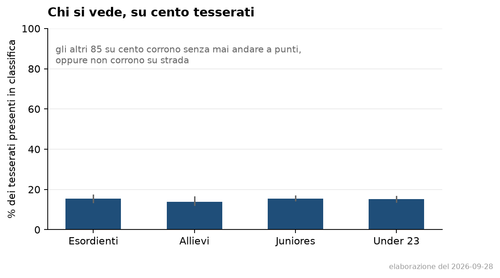

*La barra è la media delle stagioni, la linea l'intervallo fra la stagione più bassa e la più alta. La stabilità fra categorie e fra anni è il dato più notevole.*

> **Conseguenza sulla lettura di tutto il documento.** Quando si legge che il — per mille dei classificati in Esordienti diventa professionista, il denominatore è quel settimo. Rapportata a tutti i tesserati la quota sarebbe circa sette volte più bassa. Non si è fatta la moltiplicazione nel testo, per una ragione precisa: la copertura si misura su stagioni recenti, mentre le coorti studiate hanno corso prima, e trasferire il rapporto da un periodo all'altro sarebbe una stima travestita da misura.

### L'attrito della classifica e quello vero

La sezione sull'attrito diceva che uscire dalla classifica non significa smettere, e che la differenza non era quantificabile perché mancava l'elenco dei tesserati. Ora una parte di quella differenza si vede: i tesserati calano di categoria in categoria, e si può confrontare il loro calo con quello dei classificati.

| categoria | tesserati per anno di età | % del livello precedente | in classifica per anno di età | % del livello precedente |
|---|---|---|---|---|
| Esordienti | 1601 | — | 239 | — |
| Allievi | 1350 | 84,3 | 175 | 73,2 |
| Juniores | 844 | 62,5 | 131 | 74,9 |
| Under 23 | 265 | 31,4 | 41 | 31,3 |

*medie delle stagioni 2021-2025, le sole in cui tutte le categorie hanno il dato; i conteggi sono divisi per l'ampiezza della categoria, altrimenti l'Under 23 non sarebbe confrontabile con le altre*

**I due imbuti arrivano quasi allo stesso punto**: dall'ingresso in Esordienti all'Under 23 resta il 16,6% dei tesserati per anno di età e il 17,2% dei classificati. La classifica non si restringe più in fretta della popolazione che la genera.

I singoli passi differiscono — fra Esordienti e Allievi calano più i classificati, fra Allievi e Juniores calano più i tesserati — ma il risultato complessivo è lo stesso, e sono differenze su medie di cinque stagioni che non vale la pena interpretare una per una.

Il confronto interessante è con il **terzo** numero, quello delle persone. Questi due imbuti contano teste per stagione; seguendo invece i singoli atleti, solo il 59,7% di chi era in Esordienti si ritrova in Allievi. La distanza fra i conteggi aggregati e quella percentuale **è il ricambio**: la classifica mantiene la propria dimensione sostituendo le persone, non trattenendole.

È la conferma esterna di ciò che la sezione sull'attrito aveva già misurato dall'interno con i rientri e il rinnovo delle liste. Due fonti indipendenti, la stessa conclusione: **l'imbuto individuale che si osserva nella classifica è molto più ripido dell'abbandono reale dello sport.**

### Si possono stimare gli anni che mancano?

La tentazione è evidente: la serie dei tesserati parte dal 2018, le coorti studiate hanno corso prima, e una tendenza si estrapola in due righe. La domanda giusta non è se si possa fare, ma **se il risultato valga qualcosa** — e si può rispondere con una prova invece che con un'opinione: si stima la tendenza sulle stagioni recenti e si prova a prevedere quelle vecchie, di cui la risposta si conosce già.

| stagione | tesserati reali | stimati dalla tendenza | errore % |
|---|---|---|---|
| 2018 | 3226 | 4107 | 27,3 |
| 2019 | 3259 | 3905 | 19,8 |

*tendenza stimata sulle stagioni 2021-2025 ed estrapolata all'indietro*

**Sbaglia fino al 27%, e a soli due o tre anni di distanza.** L'estrapolazione all'indietro fino agli anni delle coorti studiate sarebbe quattro o cinque volte più lunga: l'errore non può che essere maggiore.

E c'è di peggio della semplice imprecisione. Stimando la stessa tendenza in due modi entrambi difendibili — includendo o escludendo le stagioni della pandemia — i tesserati Esordienti del 2012 risultano 5 554 oppure 3 576. Le due stime differiscono di **1,6 volte**, e la differenza non viene dai dati: viene da una decisione di chi fa il calcolo. Un numero che dipende così tanto da una scelta arbitraria non è una misura.

C'è anche una ragione sostanziale, oltre a quella statistica. Il tesseramento di una federazione non segue un andamento inerziale: risponde a politiche, a risultati sportivi, a mode. Nello stesso periodo la Gran Bretagna è passata da quindicimila a centosessantacinquemila tesserati. Una serie di otto anni non contiene l'informazione per sapere cosa succedeva quindici anni prima.

**Quindi no: gli anni mancanti non si stimano.** Quello che si può fare, e che questo documento fa, è dichiarare la copertura misurata dove esiste e trattare il periodo studiato come non misurato. La differenza fra le due cose è esattamente la differenza fra un dato e una supposizione.

> **Perché questo non intacca le conclusioni.** La copertura serve a dare scala alle percentuali assolute, non entra in nessun modello. I confronti fra categorie, i coefficienti, le AUC e i test sono tutti calcolati *dentro* la popolazione dei classificati, e non cambiano se il denominatore esterno è un settimo o un quinto. L'unico rischio sarebbe che la selettività fosse cambiata **fra una coorte e l'altra** dello studio: ma questo si controlla, e i modelli aggiustati per anno di nascita danno coefficienti che differiscono da quelli grezzi di meno di 0,01.

Un'ultima cifra, per dare la misura del bersaglio: le licenze da professionista rilasciate dalla federazione sono state fra **65 e 98** nelle stagioni osservate. Non è il numero di posti che si liberano ogni anno — è l'intera popolazione professionistica italiana, di ogni età, in un dato momento.

## Quanti posti ci sono, e chi se li prende

Le sezioni precedenti hanno mostrato che al cambio di categoria la classifica si svuota. La spiegazione naturale è che ci siano meno posti, ed è la lettura che circola di solito. Vale la pena controllarla, perché i posti si possono contare.

> **Come si misura — Due strutture diverse, e la differenza cambia la lettura**
>
> La fonte non pubblica una classifica sola per tutte le categorie giovanili. In **Esordienti** ogni annata ha la propria graduatoria: primo e secondo anno corrono gare distinte e non si fanno concorrenza. In tutte le altre categorie la classifica è **una sola** e le annate convivono, per cui un atleta al primo anno prende punti nelle stesse gare dei più grandi.
>
> La differenza non è un dettaglio di archivio: rende le due situazioni non confrontabili, e permette di usare la prima come **caso di controllo** per capire cosa succeda nella seconda.
>
> I posti si contano così: ogni gara assegna cinque piazzamenti a punti, quindi la somma dei piazzamenti nei primi cinque è il numero di posti messi in palio, e diviso cinque stima il numero di **classificazioni di gara**: non le gare davvero corse, ma quelle che hanno lasciato una traccia nella fonte. La fonte non pubblica il calendario, ma pubblica i piazzamenti.
>
> Approfondimenti: [La verifica sulla struttura delle liste](docs/verifica_dati_giovanile.md)

| categoria | annate | una lista per annata | classificazioni di gara per stagione | posti a punti per stagione | atleti in classifica per stagione | posti per atleta |
|---|---|---|---|---|---|---|
| Esordienti | 2 | sì | 639 | 3 197 | 588 | 5,43 |
| Allievi | 2 | no | 414 | 2 070 | 479 | 4,32 |
| Juniores | 2 | no | 282 | 1 410 | 331 | 4,25 |
| Under 23 | 4 | no | 146 | 730 | 176 | 4,14 |

*i posti sono stimati dai piazzamenti nei primi cinque, cinque per gara; negli Esordienti, che hanno una classifica per annata, il conteggio somma i due calendari; per l'Under 23 sono un limite inferiore, perché la lista sorgente contiene anche gli Elite, esclusi dalla finestra d'età*

**Una parte della lettura corrente è giusta: i posti calano davvero.** Si passa da 639 classificazioni di gara per stagione in Esordienti a 146 in Under 23. Il calendario si accorcia, e con esso la lista, per ragioni che non hanno nulla a che vedere con il valore dei ragazzi.

> **Un confronto da fare con una cautela.** Negli Esordienti le due annate hanno classifiche distinte e corrono gare distinte, quindi il conteggio somma i due calendari; nelle altre categorie la classifica è una sola e le annate corrono insieme. Il numero degli Esordienti è quindi comparabile agli altri solo accettando che a quell'età si corra davvero separati. Non è più un'assunzione: le Norme Attuative della federazione prevedono che le due annate corrano separatamente, e che anche quando la gara è unica la classifica sia distinta per fascia d'età (art. 4.2.1 e 4.2.5, con l'eccezione dei meno di dieci partenti all'art. 4.2.4). La verifica sui regolamenti sta in `docs/verifica_dati_giovanile.md`. Chi preferisce comunque la lettura prudente può dimezzare il conteggio: resta un calo anche partendo da metà.

### Ma il primo anno non sparisce per mancanza di posti

| categoria | anno di categoria | atleti | posti presi | quota dei posti | posti per atleta |
|---|---|---|---|---|---|
| Esordienti | 1 | 4 499 | 25 415 | 49,7% | 5,65 |
| Esordienti | 2 | 4 914 | 25 741 | 50,3% | 5,24 |
| Allievi | 1 | 3 065 | 9 948 | 26,7% | 3,25 |
| Allievi | 2 | 5 552 | 27 308 | 73,3% | 4,92 |
| Juniores | 1 | 2 474 | 8 458 | 33,3% | 3,42 |
| Juniores | 2 | 3 491 | 16 916 | 66,7% | 4,85 |
| Under 23 | 1 | 603 | 1 551 | 11,8% | 2,57 |
| Under 23 | 2 | 862 | 3 341 | 25,4% | 3,88 |
| Under 23 | 3 | 877 | 4 073 | 31,0% | 4,64 |
| Under 23 | 4 | 833 | 4 167 | 31,7% | 5,00 |

*dove la classifica è unica le gare sono le stesse per tutte le annate, quindi la quota misura la concorrenza e non la disponibilità*

**Il confronto è netto.** In Esordienti, dove ogni annata ha la propria classifica, il primo anno prende il **49,7%** dei posti: praticamente metà, come dev'essere quando nessuno fa concorrenza a nessuno. In Allievi, dove la lista è una sola e le gare sono le stesse, il primo anno ne prende il **26,7%**.

Quei due numeri, messi uno accanto all'altro, dicono che il crollo del primo anno **non è una questione di posti disponibili**. I posti sono gli stessi per le due annate, perché sono le stesse gare: quello che cambia è chi li vince. Un Allievo al primo anno corre contro ragazzi che hanno un anno di sviluppo in più, e i piazzamenti a punti se li prendono loro.

L'Under 23 lo mostra su quattro annate invece che su due: la quota dei posti sale da 11,8% al primo anno fino a 31,7% al quarto. È lo stesso meccanismo, osservato più a lungo.

*Gli Esordienti sono l'unica categoria in cui ogni annata ha la propria classifica, e infatti i posti si dividono quasi a metà. Nelle altre la lista è una sola e le gare sono le stesse per tutti: lì il primo anno ne prende una minoranza, che è concorrenza e non scarsità di posti.*

> **Cosa se ne ricava per il resto del documento.** Dove si legge che al primo anno di una categoria «la lista è più corta», la frase va intesa così: la lista di quell'annata è più corta perché i suoi atleti vincono meno posti, non perché la fonte pubblichi meno righe. Nelle categorie a lista unica non esiste una classifica del primo anno: esiste una classifica sola, che noi dividiamo per annata quando calcoliamo il percentile.

### Quanto sono concentrati i punti

Chi guarda una classifica giovanile ha spesso l'impressione che i punti se li dividano sempre le stesse facce. Quello che si misura qui è metà di quella impressione: quanta parte del totale finisce al decile migliore, chiunque esso sia. La concentrazione dei punti e la persistenza delle stesse persone sono due cose diverse, e una classifica può essere concentratissima e rinnovare i volti ogni stagione: chi resta di anno in anno lo dice la correlazione fra stagioni consecutive, misurata più avanti, non questa tabella.

| categoria | anno di categoria | stagioni | atleti per stagione | punti presi dal 10% migliore | Gini |
|---|---|---|---|---|---|
| Esordienti | 1 | 16 | 281 | 40,4% | 0,591 |
| Esordienti | 2 | 16 | 307 | 38,4% | 0,561 |
| Allievi | 1 | 18 | 170 | 38,0% | 0,535 |
| Allievi | 2 | 18 | 308 | 37,8% | 0,553 |
| Juniores | 1 | 18 | 137 | 42,9% | 0,578 |
| Juniores | 2 | 18 | 194 | 43,2% | 0,598 |
| Under 23 | 1 | 11 | 39 | 38,9% | 0,558 |
| Under 23 | 2 | 18 | 48 | 39,1% | 0,596 |
| Under 23 | 3 | 18 | 49 | 39,6% | 0,590 |
| Under 23 | 4 | 16 | 49 | 36,7% | 0,567 |

*medie sulle stagioni; il Gini vale 0 se tutti hanno gli stessi punti e 1 se li ha una persona sola*

**Il dieci per cento migliore prende fra il 36,7% e il 43,2% dei punti**, e la cosa notevole è che questa quota non cambia salendo di categoria: è la stessa a tredici anni e a ventidue. Il Gini si muove fra 0,535 e 0,598, che è un intervallo stretto per una misura che potrebbe andare da 0 a 1.

È un risultato che vale come risposta a due domande diverse. Alla prima, se si piazzino sempre gli stessi, la risposta è sì: i punti sono molto concentrati, e un decile che ne prende quattro volte la propria quota è molta concentrazione. Alla seconda, se la selezione si stringa con l'età, la risposta è no: la forma della distribuzione è già quella a tredici anni e resta quella fino all'Under 23.

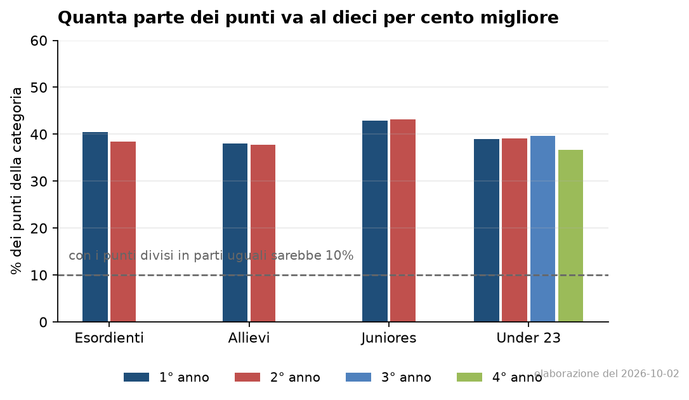

*La concentrazione è quasi la stessa a tredici e a ventidue anni: salendo di categoria i punti non si concentrano in meno mani.*

### Quanti posti c'erano prima

Contati i posti, viene naturale chiedersi se siano sempre stati tanti. La risposta è no, ed è la cosa più inattesa di questa sezione.

| categoria | gare nel 2009 | gare nel 2025 | variazione |
|---|---|---|---|
| Esordienti | 865 | 522 | -39,7% |
| Allievi | 562 | 309 | -44,9% |
| Juniores | 365 | 199 | -45,5% |
| Under 23 | 212 | 88 | -58,3% |

*stime dai piazzamenti; le stagioni anomale sono escluse dagli estremi ma non dal grafico*

**Il calendario giovanile italiano osservabile nella fonte si è quasi dimezzato.** Fra il 2009 e il 2025 le classificazioni di gara calano in ogni categoria, fino a -58,3% in Under 23. Non è un effetto della pandemia: il 2020 è un crollo a sé, e dopo di esso il calendario non è tornato ai valori precedenti.

Prima di prenderlo per buono va considerata l'alternativa più ovvia, cioè che a calare sia la copertura della fonte e non il calendario vero. Il controllo si può fare solo dove esistono i tesserati federali, cioè dal 2018: in quella finestra i tesserati Esordienti calano di circa un decimo e le gare stimate di quasi un quinto. Il movimento si sta restringendo, e il calendario si restringe più in fretta del movimento.

> **Perché riguarda il resto dello studio.** Le coorti in esame hanno corso quando le gare erano di più. Un ragazzo di oggi ha meno occasioni di andare a punti di quante ne avesse un suo pari di quindici anni fa, il che rende la classifica di oggi un filtro più stretto. I confronti fra coorti di questo documento sono aggiustati per anno di nascita, ma vale la pena saperlo quando si legge un percentile recente accanto a uno vecchio.

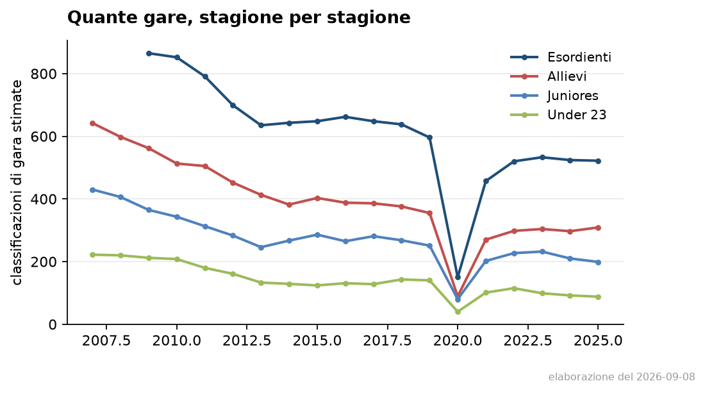

*Il calo è comune a tutte le categorie e comincia molto prima della pandemia. Il 2020 è la stagione dimezzata dal covid, e dopo di essa il calendario non è tornato ai valori precedenti.*

Un'ultima domanda, che lega questa sezione al resto del documento: quanta parte dei posti va a chi poi diventerà professionista?

| categoria | quota dei classificati | quota dei posti presi | rapporto |
|---|---|---|---|
| Esordienti | 3,5% | 7,3% | 2,1 volte |
| Allievi | 5,3% | 13,0% | 2,5 volte |
| Juniores | 8,9% | 23,0% | 2,6 volte |
| Under 23 | 29,6% | 46,8% | 1,6 volte |

*coorti in studio; il rapporto dice quante volte i futuri professionisti sono sovrarappresentati nei piazzamenti a punti*

Già in Esordienti i futuri professionisti prendono il **7,3%** dei posti pur essendo il 3,5% dei classificati, cioè 2,1 volte la loro quota. È la stessa cosa che le sezioni sui punteggi mostrano con i percentili, vista dal lato dei posti invece che da quello degli atleti: a tredici anni il vantaggio si vede già.

> **Un limite della stima dei posti.** Contare le gare dai piazzamenti assume che ogni gara assegni cinque posti e che tutti i piazzamenti finiscano in classifica. Per l'Under 23 il conto è un limite inferiore, perché la lista sorgente comprende anche gli Elite, che qui restano fuori dalla finestra d'età: le gare vere sono di più di quelle stimate, e i posti che i giovani non prendono vanno in parte a corridori più grandi che questo studio non conta.

## Il passaggio di categoria è una rottura?

Le uscite dalla classifica si concentrano nell'ultimo anno di ogni categoria, e la lettura naturale è che il cambio di fascia sia un trauma: distanze nuove, avversari più grandi, squadra diversa. È plausibile, ed è proprio per questo che conviene metterla alla prova invece di darla per buona.

> **Come si misura — Come si mette alla prova l'idea di rottura**
>
> Si confrontano passaggi di stagione che distano tutti un anno, divisi in due tipi: quelli **dentro** una categoria, dal primo al secondo anno, e quelli **fra** categorie. La distanza temporale è la stessa, cambia solo se ci sia o no un cambio di fascia.
>
> «Rottura» può voler dire due cose diverse, con implicazioni opposte. Che **spariscano più persone** — un problema di ritenzione. O che **si rimescoli l'ordine** fra chi resta — un problema di valutazione, perché vorrebbe dire che il risultato di una stagione dice poco su quella successiva. Le due si misurano separatamente.
>
> C'è una trappola da disinnescare: al primo anno di una categoria gli atleti sono molto meno numerosi che al secondo, perché corrono nella stessa lista dei più grandi e vincono una minoranza dei piazzamenti a punti. Se un'annata occupa un quarto dei posti invece della metà, gran parte delle persone esce dalla classifica anche senza che sia successo nulla. Per questo si guarda anche **da dove viene la lista di arrivo**: quanta parte è composta da chi c'era già. Quella quota non dipende da quanti siano i posti né da chi li vinca.
>
> Approfondimenti: [Correlazione di Spearman](https://en.wikipedia.org/wiki/Spearman%27s_rank_correlation_coefficient)

| passaggio | tipo | in classifica prima | in classifica dopo | % che resta | % della lista di arrivo che c'era già | correlazione fra i due percentili | spostamento mediano (punti) |
|---|---|---|---|---|---|---|---|
| U15y1 → U15y2 | dentro la categoria | 1678 | 1786 | 76,3 | 71,7 | 0,658 | 13,0 |
| U15y2 → U17y1 | cambio di categoria | 1786 | 927 | 44,3 | 85,3 | 0,524 | 16,6 |
| U17y1 → U17y2 | dentro la categoria | 927 | 1602 | 85,0 | 49,2 | 0,538 | 15,7 |
| U17y2 → U19y1 | cambio di categoria | 1602 | 701 | 39,1 | 89,4 | 0,484 | 18,1 |
| U19y1 → U19y2 | dentro la categoria | 701 | 901 | 78,6 | 61,2 | 0,576 | 14,6 |
| U19y2 → U23y1 | cambio di categoria | 901 | 137 | 13,7 | 89,8 | 0,404 | 24,4 |

*tutti i passaggi distano una stagione: la sola differenza è se comportino o no un cambio di fascia*

**Il crollo c'è, ed è grande.** Dentro una categoria resta in classifica il 80,0% degli atleti; al cambio di fascia il 32,4%. Presa così, la lettura del trauma sembra confermata.

**Ma la colonna successiva dice il contrario, e con la stessa forza.** La lista che si trova dopo un cambio di categoria è composta per il 88,2% da persone che c'erano già; dopo un passaggio interno, solo per il 60,7%. Al cambio di fascia non entra quasi nessuno di nuovo.

I due numeri sembrano contraddirsi e non si contraddicono: al cambio di categoria **l'annata che arriva occupa molti meno posti**. Passa da essere la più anziana della propria lista a essere la più giovane, contro ragazzi con un anno di sviluppo in più, e nelle stesse gare vince molto meno. Resta quindi meno gente, ma i posti che restano se li tengono quasi tutti quelli che c'erano. Il ricambio vero, l'ingresso di facce nuove, avviene **dentro** la categoria, dove l'annata cresce di peso.

Quello che sembrava un trauma del passaggio di fascia è in buona parte **una conseguenza di come sono fatte le classifiche**: dagli Allievi in su la lista è una sola e le annate convivono, quindi al primo anno si compare poco per definizione. Chi esce al cambio di fascia in molti casi non ha smesso e non è peggiorato: ha smesso di battere ragazzi più grandi.

Resta la seconda domanda: fra chi il posto ce l'ha, l'ordine si rimescola? Un po' di più, ma poco. La correlazione fra i percentili di due stagioni consecutive è 0,591 dentro la categoria e 0,471 al cambio di fascia. La differenza esiste e va nella direzione attesa, ma è modesta: **il cambio di categoria toglie persone dalla classifica molto più di quanto rimescoli quelle che restano**.

Lo stesso in una forma più concreta: chi resta in classifica si sposta di 14,4 punti di percentile in mediana dentro la categoria, e di 19,7 al cambio di fascia. Su una scala da 0 a 100, e con il proprio piazzamento che dipende anche da quante gare si sono corse, sono spostamenti dello stesso ordine.

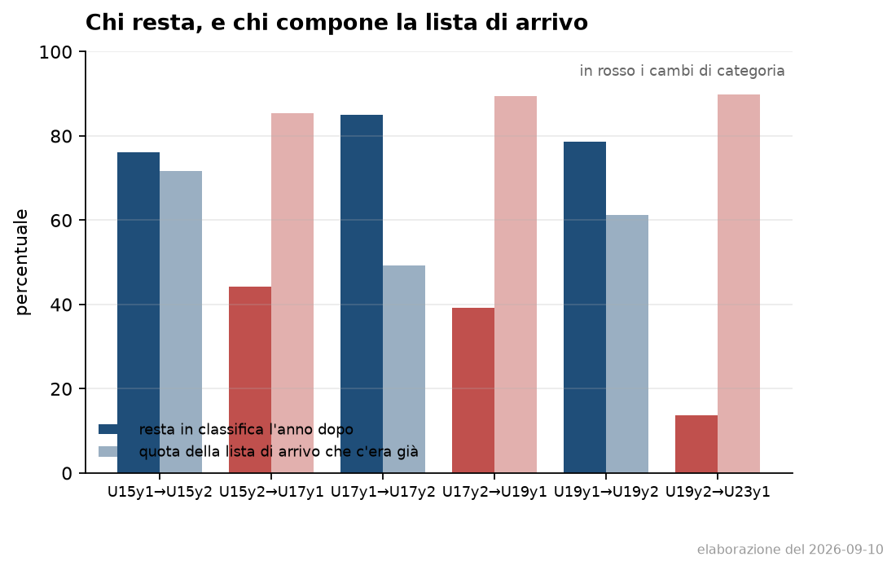

*Le due misure vanno in direzioni opposte proprio dove ci si aspetterebbe la rottura: al cambio di categoria resta meno gente, ma la lista di arrivo è fatta quasi solo di loro.*

> **Cosa se ne ricava, per chi allena.** L'idea che al cambio di categoria si perdano i ragazzi perché il salto è troppo duro non trova conferma in questi dati — o meglio, non nella forma in cui la si racconta di solito. Chi era in classifica ci resta, se un posto c'è. Quello che cambia bruscamente è quanto è larga la porta. Un ragazzo che sparisce dalla classifica al primo anno di una categoria nuova sta molto probabilmente ancora correndo, contro avversari di un anno più grandi, in una lista che ha metà dei posti di prima.

## Chi è arrivato andava già meglio?

Prima di qualunque modello vale la pena guardare la cosa più semplice: il percentile di chi è diventato professionista, confrontato con quello di tutti gli altri, stagione per stagione.

Il numero da guardare **non è il p-value**. Con milleseicento non professionisti contro sessanta professionisti qualunque differenza risulta significativa: il p direbbe solo che il campione è grande. Il numero che conta è il **delta di Cliff**, che misura quanto le due distribuzioni si separano, e che si traduce direttamente in area sotto la curva: `AUC = (delta + 1) / 2`.

> **Come si misura — Delta di Cliff**
>
> Si prendono tutte le coppie possibili fra un professionista e un non professionista e si conta quante volte il primo ha un percentile più alto. Il delta è la differenza fra la quota di coppie in cui vince il professionista e quella in cui vince l'altro: vale 1 se i professionisti stanno tutti sopra, 0 se le due distribuzioni sono sovrapposte, -1 nel caso opposto. I pari merito non contano.
>
> Non assume né normalità né varianze uguali, e non risente dei valori estremi: guarda solo l'ordinamento. Soglie convenzionali: sotto 0,15 trascurabile, 0,33 piccolo, 0,47 medio, sopra 0,47 grande.
>
> Si converte in area sotto la curva ROC con AUC = (delta + 1) / 2, che è il ponte fra questa descrittiva e i modelli.
>
> Approfondimenti: [Effect size](https://en.wikipedia.org/wiki/Effect_size) · [Curva ROC e AUC](https://en.wikipedia.org/wiki/Receiver_operating_characteristic)

> **Come si misura — Mediana e scarto interquartile**
>
> La mediana è il valore che lascia metà degli atleti sopra e metà sotto. Fra parentesi quadre c'è l'intervallo fra il primo e il terzo quartile, cioè la fascia in cui sta la metà centrale del gruppo.
>
> Si usano al posto di media e deviazione standard perché i percentili qui non sono distribuiti simmetricamente e hanno grossi ammassi in coda: la media verrebbe tirata dai valori estremi, la mediana no.
>
> Approfondimenti: [Scarto interquartile](https://en.wikipedia.org/wiki/Interquartile_range) · [Percentile](https://en.wikipedia.org/wiki/Percentile_rank)

| cella | atleti | % pro | non pro: mediana [IQR] | pro: mediana [IQR] | delta di Cliff | entità | AUC |
|---|---|---|---|---|---|---|---|
| U15y1 | 1678 | 3,50 | 49 [27-74] | 81 [56-94] | 0,47 | grande | 0,74 |
| U15y2 | 1786 | 3,50 | 49 [27-74] | 90 [66-96] | 0,57 | grande | 0,79 |
| U17y1 | 927 | 6,70 | 50 [27-72] | 90 [73-96] | 0,63 | grande | 0,81 |
| U17y2 | 1602 | 4,50 | 49 [26-73] | 92 [83-98] | 0,72 | grande | 0,86 |
| U19y1 | 701 | 9,70 | 47 [28-71] | 91 [68-97] | 0,61 | grande | 0,81 |
| U19y2 | 901 | 8,20 | 47 [24-70] | 94 [82-98] | 0,78 | grande | 0,89 |
| U23y1 | 137 | 37,20 | 47 [33-64] | 75 [43-91] | 0,40 | medio | 0,70 |

*il percentile va da 0 a 100; la colonna «% pro» è il tasso di professionisti della cella, e serve a non confrontare fra loro delta calcolati su popolazioni diverse*

**Già a tredici anni la separazione è netta.** Il delta in U15y1 vale **0,470**, cioè appena sopra il confine convenzionale fra «medio» e «grande», che sta a 0,47: la tabella lo arrotonda a due cifre e per questo sembra caderci esattamente sopra. Sale poi fino a **0,78** in U19y2 — un'AUC di 0,89, che è l'ordine di grandezza di ciò che un modello univariato potrà ottenere.

**Attenzione però all'ultima riga.** In U23y1 il delta scende a 0,40, e sarebbe facile leggerlo come «il rendimento da Under 23 conta meno». Non è così: in quella cella i professionisti sono il **37%**, contro poche unità percentuali nelle categorie giovanili. Chi arriva lì è già un sopravvissuto, e il confronto avviene fra atleti già selezionati. I delta di righe diverse **non sono confrontabili** fra loro, ed è il motivo per cui la tabella riporta il tasso di professionisti accanto a ciascuno.

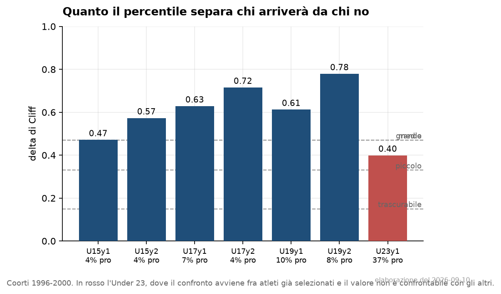

*La separazione fra chi arriverà e chi no è già «grande» a tredici anni, e cresce fino all'ultimo anno da Juniores.*

> **Come si misura — Perché il p-value non compare in tabella**
>
> Il test di Mann-Whitney è calcolato e conservato nell'archivio dei risultati, ma non è riportato qui. Con gruppi così sbilanciati — millesettecento contro sessanta — il p diventa minuscolo per differenze di qualunque entità, e risponde alla domanda sbagliata: dice se la differenza esiste, non quanto è grande. In tutte le celle risulta comunque sotto un millesimo.
>
> Approfondimenti: [Test di Mann-Whitney](https://en.wikipedia.org/wiki/Mann%E2%80%93Whitney_U_test)

### Il gradiente per livello raggiunto

| cella | non pro | pro senza top 500 | top 500 | top 100 |
|---|---|---|---|---|
| U15y1 | 49 (n=1619) | 69 (n=31) | 89 (n=22) | 84 (n=6) |
| U15y2 | 49 (n=1723) | 86 (n=33) | 90 (n=24) | 94 (n=6) |
| U17y1 | 50 (n=865) | 86 (n=29) | 90 (n=26) | 97 (n=7) |
| U17y2 | 49 (n=1530) | 92 (n=35) | 92 (n=29) | 98 (n=8) |
| U19y1 | 47 (n=633) | 90 (n=34) | 90 (n=26) | 98 (n=8) |
| U19y2 | 47 (n=827) | 91 (n=37) | 93 (n=29) | 99 (n=8) |
| U23y1 | 47 (n=86) | 58 (n=22) | 76 (n=22) | 93 (n=7) |

*fra parentesi la numerosità; dove è sotto la soglia si riporta solo quella, non la mediana*

La mediana cresce con il livello raggiunto, e non solo fra chi arriva e chi no: è una relazione dose-risposta, qualitativamente diversa da un confronto fra due gruppi, perché un rumore casuale non produce una scala ordinata. La crescita è però monotona in tutte le celle tranne U15y1, dove l'ultima colonna scende. Le colonne di destra sono comunque sottili — otto atleti in tutto arrivano in top 100 — e vanno lette come indicazione, non come stima.

## L'effetto dell'età relativa

Fra ragazzi della stessa annata, chi è nato a gennaio ha fino a dodici mesi di sviluppo in più di chi è nato a dicembre. Alle età più basse quella differenza è difficile da separare dalla prestazione vera e propria: se pesa molto, selezionare sul risultato a tredici anni significa in parte selezionare la data di nascita.

Il confronto non è con il 25 per cento per trimestre. In Italia si nasce di più fra maggio e settembre, e il primo trimestre è il **più scarso** della popolazione: l'atteso è Q1 23,95%, Q2 25,24%, Q3 26,30%, Q4 24,50%. Usare l'uniforme sottostimerebbe l'effetto invece di sovrastimarlo.

> **Come si misura — Rapporto fra osservato e atteso, e w di Cohen**
>
> Per ogni trimestre si divide la quota di atleti nati in quel trimestre per la quota di nati nella popolazione italiana delle stesse annate. Un valore di 1,39 significa che quel trimestre è rappresentato del 39% in più di quanto la demografia giustifichi.
>
> La w di Cohen riassume in un solo numero quanto l'intera distribuzione si discosta dall'attesa: vale 0 quando la distribuzione coincide con l'attesa e cresce con lo scostamento, e con quattro trimestri non può superare la radice di 3. Per convenzione 0,1, 0,3 e 0,5 indicano un effetto piccolo, medio e grande. Si riporta al posto del p-value del test chi quadro perché con migliaia di osservazioni quel test risulta significativo anche per squilibri irrilevanti, mentre w misura l'entità dello squilibrio e non la sua rilevabilità.
>
> L'attesa demografica viene dalle nascite mensili registrate in Italia, non da una distribuzione uniforme.
>
> Approfondimenti: [Bontà di adattamento](https://en.wikipedia.org/wiki/Goodness_of_fit) · [w di Cohen](https://en.wikipedia.org/wiki/Effect_size#Cohen%27s_w) · [Effetto dell'età relativa](https://en.wikipedia.org/wiki/Relative_age_effect) · [Nascite per mese, Eurostat](https://ec.europa.eu/eurostat/databrowser/view/demo_fmonth/default/table)

### Chi entra nel ranking

| categoria | atleti | Q1 oss/att | Q2 | Q3 | Q4 | Q1/Q4 | w di Cohen |
|---|---|---|---|---|---|---|---|
| U15 | 2177 | 1,39 | 1,12 | 0,85 | 0,65 | 2,13 | 0,28 |
| U17 | 1741 | 1,30 | 1,02 | 0,95 | 0,75 | 1,75 | 0,20 |
| U19 | 1051 | 1,15 | 1,05 | 0,96 | 0,85 | 1,35 | 0,11 |
| U23 | 336 | 0,99 | 1,04 | 1,05 | 0,91 | 1,09 | 0,06 |

*valori sopra 1 = più atleti dell'atteso demografico*

Il vantaggio si spegne con l'età: da **2,13 a uno** in U15 a **1,09** in U23. E questo confronto non ha bisogno di alcun dato esterno, perché riguarda le stesse coorti ai due estremi e la stagionalità demografica si cancella.

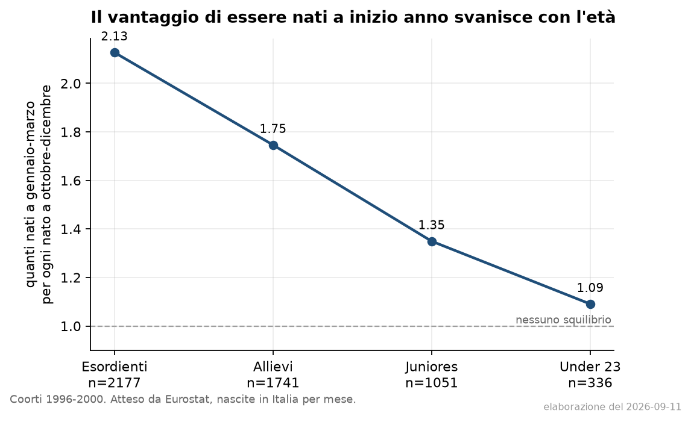

*Il rapporto fra chi è nato nel primo e nel quarto trimestre, corretto per la stagionalità delle nascite, scende da 2,13 in U15 a 1,09 in U23.*

### Chi arriva, fra quelli entrati

| gruppo | n | Q1 | Q2 | Q3 | Q4 | Q1/Q4 |
|---|---|---|---|---|---|---|
| tutti i classificati | 2800 | 865 | 753 | 670 | 512 | 1,7 |
| professionisti | 77 | 23 | 25 | 13 | 16 | 1,5 |
| top 500 | 37 | 11 | 12 | 6 | 8 | 1,4 |
| top 100 | 8 | <5 | <5 | <5 | <5 | 1,5 |

*4 cella/e con meno di 5 atleti sono mascherate · i conteggi sono atleti; le celle sotto la soglia sono mascherate*

Il confronto va fatto con la riga giusta. Il rapporto dei professionisti è calcolato su atleti di tutte le categorie, quindi il suo termine di paragone è quello di tutti i classificati, 1,73, e non il 2,13 della categoria più giovane. Da 1,73 a 1,47, su 77 atleti, è uno scarto piccolo, e il valore dei professionisti non si distingue dall'atteso demografico (p = 0,12): preso da solo è un indizio, non una prova.

La prova più forte sta nei modelli. Aggiungendo l'età relativa, il peso del piazzamento a tredici anni passa da 1,40 a 1,40, e l'età relativa da sola distingue chi arriverà con un'AUC di 0,513, cioè come una monetina. Messi insieme, i due risultati dicono che il vantaggio di chi è nato a inizio anno è soprattutto di **accesso** alla classifica, non di arrivo.

### Lo stesso effetto sulle ragazze

È una delle poche analisi dello studio che si possono rifare sul femminile, e la ragione non è la numerosità. Tutte quelle sulla previsione hanno bisogno di un esito di carriera, e per le atlete quell'esito **non è stato raccolto**: le rose e le classifiche scaricate da ProCyclingStats sono quelle maschili. L'effetto dell'età relativa fa eccezione perché confronta la composizione del ranking con la demografia, e chiede solo la data di nascita; lo stesso vale per il cambio di regolamento delle Esordienti raccontato nella sezione sulle ragazze.

Il confronto ha un motivo sostanziale, oltre alla disponibilità dei dati. Le ragazze maturano prima: a tredici anni molte hanno già attraversato la pubertà, mentre fra i coetanei maschi la differenza di sviluppo fra gennaio e dicembre è al suo massimo. Se il vantaggio di essere nati a inizio anno è un vantaggio di maturazione, e non di talento, fra le atlete dovrebbe essere più debole.

| categoria | sesso | atleti | coorti | Q1 oss/att | Q4 oss/att | Q1/Q4 | w di Cohen | p |
|---|---|---|---|---|---|---|---|---|
| U15 | maschi | 5 544 | 1997-2012 | 1,37 | 0,69 | 1,98 | 0,254 | < 0,001 |
| U15 | femmine | 874 | 1997-2012 | 1,31 | 0,87 | 1,51 | 0,188 | < 0,001 |
| U17 | maschi | 4 486 | 1995-2010 | 1,28 | 0,74 | 1,73 | 0,195 | < 0,001 |
| U17 | femmine | 681 | 1995-2010 | 1,15 | 0,96 | 1,20 | 0,089 | 0,144 |
| U19 | maschi | 3 045 | 1993-2008 | 1,12 | 0,87 | 1,29 | 0,099 | < 0,001 |
| U19 | femmine | 370 | 1993-2008 | 1,36 | 0,95 | 1,42 | 0,205 | 0,001 |

*per ogni categoria si usano le coorti in cui entrambi i sessi sono osservati, e l'atteso demografico è calcolato su quelle stesse coorti; nel periodo studiato la fonte non pubblica una classifica Under 23 femminile*

**A tredici anni il pattern è quello atteso, e regge a un test.** In U15 i nati nel primo trimestre sono, rispetto all'atteso, 1,98 volte quelli dell'ultimo fra i maschi e 1,51 volte fra le femmine, sulle stesse coorti e con lo stesso atteso demografico; la differenza fra i due sessi ha p = 0,007 al chi quadro sui due trimestri estremi, che sulle stesse coorti basta, perché l'atteso demografico è lo stesso per tutti e due e si semplifica. È il risultato che ci si aspetta se il vantaggio è soprattutto di maturazione, anche se da solo non lo dimostra.

> **Due cautele, e sono serie.** Le atlete sono 874 in Esordienti contro 5 544 atleti, quindi gli intervalli attorno ai valori femminili sono molto più larghi. E oltre i quattordici anni i valori femminili non seguono una linea: in Allieve lo squilibrio non si distingue dall'atteso (p = 0,144 su 681 atlete), in Juniores torna a distinguersi (p = 0,001 su 370), con una w di Cohen di 0,205, più alta dello 0,188 delle Esordienti. Nessuno dei due va preso come conferma o come smentita dell'ipotesi, perché con poche centinaia di atlete per categoria non si può dire se fra Allieve e Juniores ci sia una differenza vera. Quello che si può dire con ragionevole sicurezza riguarda le età più basse, dove i numeri sono maggiori.

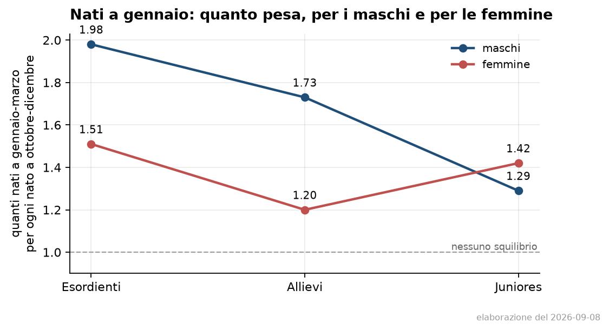

*A tredici anni fra le atlete lo squilibrio c'è ma è più contenuto. Dopo, i valori femminili poggiano su poche centinaia di atlete e non seguono una linea: in Allieve non si distinguono dall'atteso, in Juniores sì.*

> **Cosa servirebbe per andare oltre.** Scaricare da ProCyclingStats le rose delle squadre femminili e le classifiche mondiali femminili renderebbe possibile sul femminile tutto il resto dello studio. Resterebbero due limiti strutturali: le atlete in classifica sono circa un decimo degli atleti, e la classifica Under 23 femminile non esiste nel periodo studiato, quindi il predittore più vicino all'esito mancherebbe.

## Quanto si somigliano le categorie

Se il rendimento a tredici anni e quello a diciassette dicono la stessa cosa, un modello che li usa entrambi non riesce a separarne i contributi. La domanda non è accademica: decide se la parte modellistica potrà usare una regressione ordinaria o dovrà essere penalizzata.

> **Come si misura — Correlazione di Spearman**
>
> Si sostituisce a ogni percentile la sua posizione in graduatoria e si misura quanto le due graduatorie concordano. Vale 1 se l'ordine degli atleti è identico nelle due categorie, 0 se non c'è relazione.
>
> Si usa al posto della correlazione di Pearson perché non richiede che la relazione sia lineare: interessa sapere se chi sta davanti a tredici anni sta davanti anche a diciassette, non se lo fa in proporzione fissa. Il quadrato del coefficiente si legge come quota di variabilità dell'ordinamento condivisa fra le due categorie.
>
> Approfondimenti: [Correlazione di Spearman](https://en.wikipedia.org/wiki/Spearman%27s_rank_correlation_coefficient)

| cella | U15y1 | U15y2 | U17y1 | U17y2 | U19y1 | U19y2 | U23y1 |
|---|---|---|---|---|---|---|---|
| U15y1 | 1,00 | 0,66 | 0,41 | 0,38 | 0,21 | 0,21 | 0,22 |
| U15y2 | — | 1,00 | 0,52 | 0,49 | 0,36 | 0,32 | 0,24 |
| U17y1 | — | — | 1,00 | 0,54 | 0,43 | 0,43 | 0,35 |
| U17y2 | — | — | — | 1,00 | 0,48 | 0,49 | 0,34 |
| U19y1 | — | — | — | — | 1,00 | 0,58 | 0,44 |
| U19y2 | — | — | — | — | — | 1,00 | 0,40 |
| U23y1 | — | — | — | — | — | — | 1,00 |

*calcolata a coppie: ogni cella usa gli atleti presenti in entrambe le celle, quindi le numerosità non sono uguali*

La coppia più concorde è **U15y1 con U15y2** (0,66), la meno concorde **U15y1 con U19y1** (0,21). L'ordine di grandezza è quello che ci si aspetta: due stagioni consecutive si somigliano, due stagioni lontane molto meno.

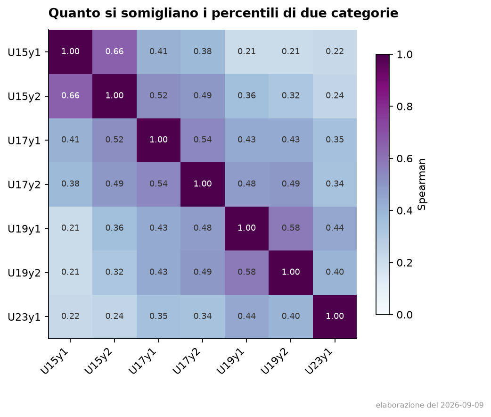

*Più le due celle sono vicine nel tempo, più l'ordinamento degli atleti si somiglia. Nessuna coppia arriva a livelli tali da rendere una delle due ridondante.*

### Serve la penalizzazione?

> **Come si misura — Fattore di inflazione della varianza (VIF)**
>
> Per ogni cella si prova a prevederne il percentile a partire da tutte le altre. Se ci si riesce bene, quella cella non porta informazione propria e in un modello che le usa tutte il suo contributo non è separabile dagli altri: i coefficienti diventano instabili e possono cambiare segno cambiando poche osservazioni.
>
> Il VIF vale 1 / (1 - R quadro) di quella previsione: 1 significa nessuna sovrapposizione, 5 significa che l'80% della variabilità è già spiegata dalle altre. Sopra 5 su più variabili la regressione penalizzata diventa necessaria.
>
> Richiede che tutte le variabili siano osservate sullo stesso atleta, ed è il motivo per cui il campione qui è molto più piccolo del totale.
>
> Approfondimenti: [Fattore di inflazione della varianza](https://en.wikipedia.org/wiki/Variance_inflation_factor) · [Multicollinearità](https://en.wikipedia.org/wiki/Multicollinearity)

| cella | VIF | R² sulle altre |
|---|---|---|
| U15y1 | 2,42 | 0,59 |
| U15y2 | 2,89 | 0,65 |
| U17y1 | 1,87 | 0,47 |
| U17y2 | 2,07 | 0,52 |
| U19y1 | 2,15 | 0,54 |
| U19y2 | 2,04 | 0,51 |

*calcolato sui 291 atleti presenti in tutte le celle elencate*

**No.** Il VIF più alto è 2,89, sotto la soglia di 5: le celle portano informazione abbastanza distinta da poter essere usate insieme in una regressione ordinaria. La versione penalizzata resta comunque utile come confronto, ma non è obbligata.

> Il VIF richiede che tutte le variabili siano osservate sullo stesso atleta, e il campione crolla: dei 2813 atleti delle coorti, solo **291** compaiono in tutte le celle considerate. È la stessa selezione che limita i modelli annidati, e va ricordata ogni volta che si cita un numero di questa sezione.

## Società, regione, mobilità

Questa sezione è scritta in negativo, e vale la pena dire subito perché. Le variabili di contesto producono con facilità correlazioni forti e sbagliate, e questa è il caso da manuale.

> **Come si misura — Perché queste variabili non entrano nei modelli come controlli**
>
> I cambi di società e di regione avvengono durante la carriera, e spesso *in risposta* ai risultati: un buon piazzamento a quattordici anni fa arrivare l'offerta di una società migliore. Stanno quindi sul percorso fra rendimento ed esito, e inserirli fra i controlli di un modello sottrarrebbe parte dell'effetto che si vuole misurare, facendolo apparire più debole di quanto sia.
>
> Diverso è il caso della società e della regione **di partenza**, che vengono prima del rendimento e potrebbero semmai essere confondenti. Non entrano nei modelli per un'altra ragione: con l'esito, come si vede più sotto, non mostrano un'associazione leggibile, quindi non c'è niente da aggiustare.
>
> Approfondimenti: [Mediazione](https://en.wikipedia.org/wiki/Mediation_(statistics)) · [Confondimento](https://en.wikipedia.org/wiki/Confounding)

| cambi di società | atleti | professionisti | % pro | stagioni corse in media |
|---|---|---|---|---|
| 0 | 1621 | 11 | 0,68 | 1,80 |
| 1 | 759 | 34 | 4,48 | 4,00 |
| 2 | 336 | 25 | 7,44 | 5,30 |
| 3 | 82 | 6 | 7,32 | 6,00 |

*l'ultima colonna è già l'indizio: chi cambia di più ha corso di più*

Preso così, il dato è clamoroso: si passa dal **0,68%** di professionisti fra chi non ha mai cambiato società al **7,32%** fra chi ha cambiato 3 volte. Un fattore dieci.

Ma l'ultima colonna dice come stanno le cose: chi non ha mai cambiato ha corso **1,8 stagioni in media**, chi ha cambiato 3 volte ne ha corse **6,0**. Non si cambia società stando fermi: per cambiarla bisogna esserci ancora.

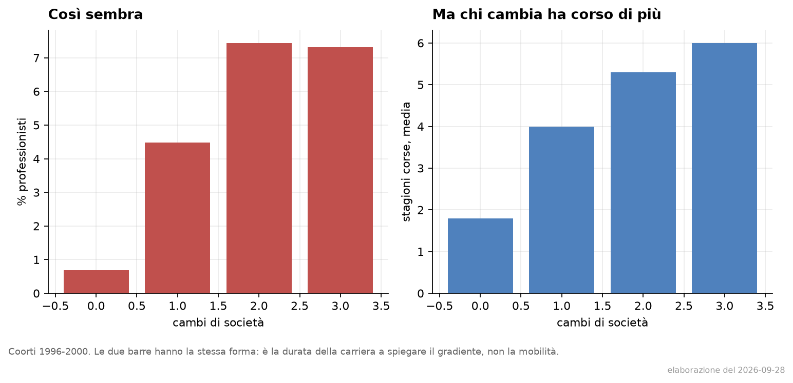

*Il gradiente apparente della mobilità ha la stessa forma della durata della carriera: è la seconda a spiegare la prima.*

### Lo stesso confronto, a parità di carriera

| durata della carriera | nessun cambio | un cambio | due o più |
|---|---|---|---|
| 1 stagione | 0,2% (n=874) | — | — |
| 2 stagioni | 0,0% (n=437) | 0,0% (n=187) | — |
| 3 stagioni | 0,6% (n=167) | 0,0% (n=195) | 1,8% (n=57) |
| 4 stagioni | 0,0% (n=93) | 0,0% (n=128) | 0,0% (n=81) |
| 5 stagioni | n=19 | 2,9% (n=104) | 0,0% (n=100) |
| 6 stagioni | n=19 | 6,8% (n=74) | 2,1% (n=95) |
| 7 stagioni | n=3 | 19,0% (n=21) | 8,3% (n=36) |
| 8 stagioni | n=2 | n=18 | 28,6% (n=28) |

*percentuale di professionisti; le celle con meno di 20 atleti riportano solo la numerosità*

**Il gradiente quasi sparisce.** Il divario grezzo era di 6,64 punti percentuali; a parità di stagioni corse ne resta al massimo 1,16, e solo 2 durate di carriera hanno abbastanza atleti in entrambi i gruppi per essere confrontate. Quello che il dato grezzo mostrava non era in gran parte un effetto della mobilità: era la durata della carriera vista da un'altra angolazione.

Non è una smentita netta — con due strati confrontabili non si smentisce niente in modo netto — ma è abbastanza per non scrivere «cambiare squadra aiuta», che è la lettura che il numero grezzo invitava a fare.

### Cambiare società spesso non è una scelta

C'è una ragione più profonda per cui questa variabile dice poco, e si vede separando i cambi che avvengono **al passaggio di categoria** da quelli che avvengono **dentro la stessa categoria**. Non tutte le società sono attive in tutte le fasce: al cambio di categoria l'atleta spesso deve cambiare squadra perché la sua non lo segue più, non perché abbia scelto.

| passaggio | atleti osservati in entrambe | hanno cambiato società | % |
|---|---|---|---|
| dentro gli Esordienti | 3296 | 522 | 15,8 |
| da Esordienti ad Allievi | 2044 | 785 | 38,4 |
| dentro gli Allievi | 2564 | 437 | 17,0 |
| da Allievi a Juniores | 2088 | 1609 | 77,1 |
| dentro gli Juniores | 1890 | 548 | 29,0 |
| da Juniores a Under 23 | 493 | 475 | 96,3 |

*il confronto è fra passaggi di categoria e transizioni dentro la stessa categoria*

Il passaggio da Juniores a Under 23 comporta un cambio di società nel **96,3% dei casi**: è di fatto obbligatorio. In media i passaggi di categoria producono un cambio nel 70,6% dei casi, contro il 20,6% delle transizioni interne a una categoria.

Segue che **`n_team_changes` conta in larga parte transizioni imposte dall'organizzazione dello sport**, non decisioni. Un atleta che arriva in Under 23 ha quasi per forza almeno due cambi alle spalle; uno che si è fermato agli Esordienti ne ha zero. La variabile è quindi un proxy di quanto lontano si è arrivati, ed è esattamente il motivo per cui il gradiente grezzo era così netto. Da Under 23 in poi i cambi tornano a essere frequenti e volontari, ma quella parte della carriera è fuori dal periodo giovanile qui misurato.

### Regione e società di partenza

|  | atleti | professionisti | % pro |
|---|---|---|---|
| è rimasto | 2657 | 73 | 2,75 |
| ha cambiato regione | 83 | 4 | 4,82 |

*la colonna dei professionisti non è mascherata perché il conteggio si ricaverebbe comunque dalla percentuale e dal numero di atleti della stessa riga*

Il cambio di regione riguarda **83 atleti su circa duemilaottocento**, con 4 professionisti fra loro. Con questi numeri non si conclude niente in un senso o nell'altro, e vale la pena dirlo esplicitamente invece di riportare una percentuale che sembrerebbe informativa.

| tasso storico della società di partenza | atleti | professionisti | % pro |
|---|---|---|---|
| nessun professionista | 1136 | 33 | 2,90 |
| fino al 5% | 58 | 2 | 3,45 |
| dal 5 al 10% | 242 | 9 | 3,72 |
| oltre il 10% | 264 | 10 | 3,79 |

*la colonna dei professionisti non è mascherata perché il conteggio si ricaverebbe comunque dalla percentuale e dal numero di atleti della stessa riga*

Anche la società da cui si parte dice poco: si va dal **2,90%** al **3,79%**, una differenza che non si distingue dal caso (p = 0,43 al test esatto di Fisher fra la prima e l'ultima fascia). E il 67% degli atleti parte da una società che nelle coorti precedenti non aveva prodotto nessun professionista — il che rende la variabile poco informativa già per costruzione.

Per la sola geografia conviene allargare le coorti. La regione di partenza non entra in nessun modello e non ha bisogno della finestra stretta che serve agli esiti: usando le **9 coorti 1992-2000** invece delle cinque del resto del documento, si arriva a 4 823 atleti e le numerosità regionali diventano leggibili. Tutte queste coorti hanno comunque avuto il tempo pieno per arrivare al professionismo.

| regione alla prima stagione | atleti | professionisti | % pro |
|---|---|---|---|
| lombardia | 1033 | 40 | 3,87 |
| veneto | 846 | 39 | 4,61 |
| toscana | 576 | 17 | 2,95 |
| emilia romagna | 477 | 10 | 2,10 |
| piemonte | 235 | 6 | 2,55 |
| sicilia | 187 | 2 | 1,07 |
| friuli venezia giulia | 175 | 3 | 1,71 |
| trentino alto adige | 174 | 11 | 6,32 |
| marche | 155 | 2 | 1,29 |
| abruzzo | 140 | 3 | 2,14 |
| lazio | 134 | 5 | 3,73 |
| campania | 132 | 0 | 0,00 |
| liguria | 126 | 4 | 3,17 |
| sardegna | 119 | 0 | 0,00 |
| umbria | 93 | 1 | 1,08 |
| puglia | 82 | 1 | 1,22 |

*coorti 1992-2000, più ampie del resto del documento; solo le regioni con almeno 50 atleti; la colonna dei professionisti non è mascherata perché il conteggio si ricaverebbe comunque dalla percentuale e dal numero di atleti della stessa riga*

La concentrazione geografica è forte: lombardia, veneto, toscana da sole raccolgono circa il 51% degli atleti.

Sui tassi, invece, conviene restare prudenti anche con le coorti allargate. Fra la regione con il tasso più alto (trentino alto adige, 6,32%) e quella più bassa (campania, 0,00%) la distanza sembra enorme, ma nasce da poche decine di professionisti distribuiti su venti regioni: bastano due o tre atleti in più o in meno per riordinare la classifica. **Questa tabella si legge come una mappa della partecipazione, non come una graduatoria dei vivai.**

Per andare oltre servirebbe una domanda diversa da quella che si può fare qui: non «quale regione produce più professionisti» ma «a parità di numero di corridori, di gare disponibili e di rendimento giovanile, la regione aggiunge qualcosa?». Le prime due grandezze non sono nei dati — né l'elenco dei tesserati né il calendario per regione sono pubblici — quindi la domanda resta aperta e va dichiarata tale.

## Quanto vale il rendimento, misurato

La descrittiva ha mostrato che chi è arrivato al professionismo andava già meglio degli altri. Un modello permette di dire **di quanto**: a quanto ammonta il vantaggio di dieci punti di percentile, e con quale incertezza.

> **Come si misura — Regressione logistica con correzione di Firth**
>
> La regressione logistica stima come cambia la probabilità di un esito binario — qui diventare professionista — al variare di un predittore. Il risultato si legge come odds ratio: quanto si moltiplica il rapporto fra probabilità di riuscire e di non riuscire per ogni aumento del predittore.
>
> La correzione di Firth serve perché l'esito è raro: i professionisti sono meno del 3% del campione. Con eventi rari la stima ordinaria è distorta verso l'alto, e quando un gruppo è perfettamente separato dall'altro non converge affatto. La penalizzazione di Jeffreys mantiene le stime finite e riduce la distorsione di piccolo campione.
>
> Qui l'odds ratio è riferito a **10 punti di percentile**: un punto solo è una differenza che nessuno percepisce, dieci punti sono il salto fra un piazzamento e quello successivo.
>
> Approfondimenti: [Regressione logistica](https://en.wikipedia.org/wiki/Logistic_regression) · [Correzione di Firth](https://en.wikipedia.org/wiki/Logistic_regression#Firth_logistic_regression) · [Odds ratio](https://en.wikipedia.org/wiki/Odds_ratio)

| cella | atleti | professionisti | % pro | OR per 10 punti | IC 95% | AUC |
|---|---|---|---|---|---|---|
| U15y1 | 1678 | 59 | 3,5 | 1,40 | 1,25-1,57 | 0,736 |
| U15y2 | 1786 | 63 | 3,5 | 1,56 | 1,38-1,78 | 0,787 |
| U17y1 | 927 | 62 | 6,7 | 1,70 | 1,48-1,98 | 0,815 |
| U17y2 | 1602 | 72 | 4,5 | 1,98 | 1,70-2,35 | 0,858 |
| U19y1 | 701 | 68 | 9,7 | 1,64 | 1,45-1,89 | 0,805 |
| U19y2 | 901 | 74 | 8,2 | 2,28 | 1,91-2,80 | 0,890 |
| U23y1 | 137 | 51 | 37,2 | 1,32 | 1,15-1,54 | 0,704 |

*Ogni riga è un modello a sé, stimato sui soli atleti presenti in quella cella. Gli odds ratio di celle diverse non sono confrontabili fra loro: cambiano le popolazioni, non solo i coefficienti.*

Il peso del rendimento cresce con l'età: si va da un odds ratio di 1,40 in U15y1 a 2,28 in U19y2, cioè un coefficiente 1,6 volte più grande. La crescita non è però regolare: in U19y1 e U23y1 il coefficiente scende rispetto alla cella precedente. Non è un'anomalia da spiegare con la prestazione — è composizione della popolazione, perché a ogni passaggio di categoria cambia chi resta nel gruppo confrontato.

I modelli sono aggiustati per anno di nascita, perché le coorti più recenti hanno avuto meno tempo per arrivare al professionismo e senza quel termine la differenza di osservazione finirebbe attribuita al rendimento. L'aggiustamento sposta pochissimo: la differenza massima rispetto al modello grezzo è inferiore a 0,01 sull'odds ratio. Il gradiente non è un effetto di coorte.

Resta la trappola già segnalata nella descrittiva: **gli odds ratio di celle diverse non sono confrontabili come misure della stessa cosa**. Il modello in Under 23 è stimato su chi è sopravvissuto a tre selezioni, dove i professionisti sono oltre un terzo del gruppo; quello in Under 15 su tutti. Sono due domande diverse, non due misure della stessa domanda.

C'è un secondo verso della selezione, meno ovvio: un atleta molto forte può passare professionista subito dopo gli Juniores e non comparire mai nelle classifiche Under 23. Se fosse frequente, i modelli sull'Under 23 sarebbero stimati su un gruppo da cui i migliori sono usciti, e ne sottostimerebbero la predittività. Succede a **3 professionisti su 77**: 11 hanno debuttato entro i vent'anni, ma quasi tutti erano comunque a punti nel ranking Under 23 di quella stagione, perché in Italia si continua a correre da Under 23 anche con un contratto da professionista. La distorsione esiste, ma è piccola.

### È rendimento, o è la data di nascita?

Fra ragazzi della stessa annata chi è nato a gennaio ha fino a dodici mesi di sviluppo in più di chi è nato a dicembre, e la sezione sull'effetto dell'età relativa mostrerà che nel ranking Under 15 i nati nel primo trimestre sono più del doppio di quelli dell'ultimo. L'obiezione è quindi legittima: a tredici anni il percentile misura il rendimento, o misura quanto presto uno è cresciuto?

Il modo diretto di rispondere è rifare ogni modello con l'età relativa dentro e guardare cosa succede al coefficiente del percentile. L'età relativa è contata in giorni fra la nascita e il 31 dicembre, non ridotta a trimestri, e il suo odds ratio si legge per cento giorni, cioè circa un trimestre.

| cella | atleti | professionisti | OR percentile | OR aggiustato | AUC | AUC aggiustata | OR età relativa | p | AUC della sola età |
|---|---|---|---|---|---|---|---|---|---|
| U15y1 | 1673 | 59 | 1,40 | 1,40 | 0,736 | 0,738 | 0,88 | 0,344 | 0,513 |
| U15y2 | 1785 | 63 | 1,56 | 1,56 | 0,787 | 0,787 | 0,93 | 0,584 | 0,513 |
| U17y1 | 927 | 62 | 1,70 | 1,70 | 0,815 | 0,815 | 1,01 | 0,939 | 0,544 |
| U17y2 | 1602 | 72 | 1,98 | 1,98 | 0,858 | 0,859 | 0,91 | 0,475 | 0,506 |
| U19y1 | 701 | 68 | 1,64 | 1,65 | 0,805 | 0,807 | 0,88 | 0,351 | 0,515 |
| U19y2 | 901 | 74 | 2,28 | 2,28 | 0,890 | 0,889 | 1,04 | 0,750 | 0,531 |
| U23y1 | 137 | 51 | 1,32 | 1,32 | 0,704 | 0,710 | 1,21 | 0,321 | 0,579 |

*L'età relativa è in giorni dal 31 dicembre e il suo odds ratio si legge per cento giorni, cioè circa un trimestre. Le due AUC sono dello stesso modello con e senza quel termine, sugli stessi atleti.*

**Non sposta niente.** Nella cella più precoce, U15y1, l'odds ratio del percentile passa da 1,40 a 1,40 e l'AUC da 0,736 a 0,738; su tutte le celle lo spostamento massimo di AUC è 0,007. E l'età relativa da sola, come unico predittore, arriva a un'AUC di **0,513**: praticamente una monetina (p = 0,344).

Il risultato va letto insieme all'altro, non al posto suo. L'età relativa pesa moltissimo su **chi entra** in classifica — è il senso del rapporto di due a uno fra primo e ultimo trimestre in Under 15 — e non pesa praticamente nulla su **chi arriva**, fra quelli entrati. Sono le due metà della stessa conclusione: un effetto di accesso, non di talento. Quello che si può dire è che il percentile non è una data di nascita travestita; quello che non si può dire è che la data di nascita non conti, perché ha già agito prima, sulla porta d'ingresso.

*Il confronto gira su 5 atleti in meno della tabella precedente: sono quelli di cui si conosce l'anno ma non il giorno di nascita, e senza quello l'età relativa non si calcola.*

### Perché la colonna «% pro» non va letta come un segnale

Nella tabella qui sopra il tasso di professionismo è più alto nelle celle del **primo** anno delle categorie a lista unica che in quelle del secondo: 6,7% contro 4,5% in U17, 9,7% contro 8,2% in U19. Sembra suggerire che il primo anno selezioni meglio. Non è così, ed è un buon esempio di come un denominatore possa produrre un segnale che non c'è.

Dagli Allievi in su la classifica è **una sola per categoria** e le due annate ci convivono, correndo le stesse gare. Al primo anno se ne vince una minoranza, e infatti i classificati sono in media 181 contro 320 in Under 17 e 141 contro 203 in Under 19. Comparire in classifica al primo anno è quindi molto più difficile: chi c'è è già più selezionato, e un gruppo più selezionato contiene per forza una quota maggiore di futuri professionisti. Il tasso misura la selettività della cella, non la qualità della previsione.

La verifica di questa spiegazione sta nella riga che non ci rientra. In **Under 15 le due annate hanno classifiche separate per regolamento**, quindi ciascuna ha i propri posti e il meccanismo del denominatore non può operare: lì i due tassi sono 3,5% e 3,5%, cioè praticamente lo stesso numero. Dove la lista è unica il divario compare, dove è doppia sparisce.

La domanda giusta — *il primo anno predice meglio del secondo?* — si risponde solo confrontando le due misure **sulle stesse persone**: gli atleti presenti in entrambe le classifiche della categoria.

| categoria | atleti | professionisti | AUC primo anno | AUC secondo anno | differenza | p (DeLong) |
|---|---|---|---|---|---|---|
| U15 | 1281 | 56 | 0,702 | 0,809 | +0,107 | < 0,001 |
| U17 | 788 | 61 | 0,805 | 0,854 | +0,048 | 0,099 |
| U19 | 551 | 68 | 0,783 | 0,869 | +0,086 | 0,002 |

*Solo gli atleti presenti in entrambe le classifiche della categoria: è l'unico confronto in cui le due misure riguardano le stesse persone.*

La risposta è netta e va nella direzione opposta all'impressione: **il secondo anno discrimina meglio del primo in tutte le categorie**, e in Under 15 e Under 19 la differenza non è attribuibile al caso. Ha senso: al secondo anno l'atleta corre contro i propri pari da un anno in più, e la classifica ne misura il rendimento con meno rumore.

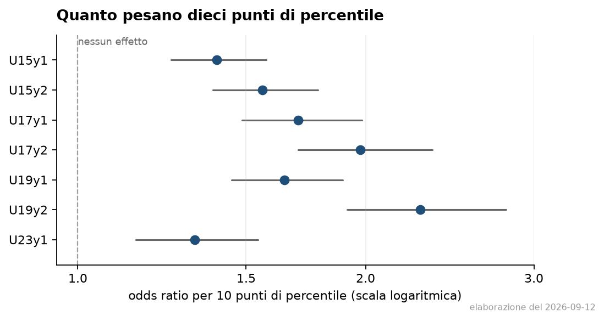

*Ogni cella è un modello a sé. Gli intervalli sono al 95% e la scala è logaritmica, perché un odds ratio si legge in rapporti e non in differenze.*

> **Controllo.** L'AUC di questi modelli e quella ricavata dal delta di Cliff nella sezione descrittiva devono coincidere: misurano la stessa quantità per due strade indipendenti. Lo scarto massimo osservato è 0,0008, cioè arrotondamento. Se le due strade divergessero, uno dei due percorsi avrebbe un errore.

## Cosa aggiunge ogni categoria

Sapere come è andato un ragazzo in Under 15 dice qualcosa. Sapere **anche** come è andato in Under 17 dice qualcosa in più, o è informazione già contenuta nella precedente? È la domanda che distingue «la prestazione giovanile predice» da «la prestazione giovanile predice, e sempre di più man mano che ci si avvicina».

I modelli si costruiscono per aggiunte successive e girano tutti sugli **stessi 102 atleti**: quelli osservati in tutte le categorie della sequenza. È una condizione stretta — restano 102 atleti su 2 813 della coorte — ma senza di essa il confronto misurerebbe il cambio di popolazione invece dell'aggiunta di informazione.

> **Come si misura — Modelli annidati, AUC e test di DeLong**
>
> Due modelli sono annidati quando uno contiene tutti i predittori dell'altro più qualcosa. Confrontarli dice quanto vale quel qualcosa.
>
> L'**AUC** è la probabilità che il modello assegni un punteggio più alto a un professionista che a un non professionista, presi a caso: 0,5 è tirare a indovinare, 1 è ordinamento perfetto.
>
> Il **test di DeLong** chiede se l'aumento di AUC è distinguibile dal caso, tenendo conto che le due curve sono calcolate sulle stesse persone e quindi sono correlate. Il **rapporto di verosimiglianza** chiede invece se il predittore in più migliora l'adattamento del modello. Sono due domande diverse, e possono rispondere in modo diverso: un predittore può migliorare l'adattamento senza cambiare l'ordine in cui il modello mette le persone.
>
> Approfondimenti: [Area sotto la curva ROC](https://en.wikipedia.org/wiki/Receiver_operating_characteristic#Area_under_the_curve) · [Test del rapporto di verosimiglianza](https://en.wikipedia.org/wiki/Likelihood-ratio_test) · [DeLong et al. 1988](https://doi.org/10.2307/2531595)

| modello | AUC | IC 95% | ΔAUC | p (DeLong) | p (verosimiglianza) |
|---|---|---|---|---|---|
| M0 (solo coorte) | 0,509 | 0,398-0,621 | — | — | — |
| M1 (+U15y2) | 0,575 | 0,461-0,689 | +0,065 | 0,360 | 0,019 |
| M2 (+U17y2) | 0,660 | 0,551-0,769 | +0,085 | 0,141 | 0,024 |
| M3 (+U19y2) | 0,811 | 0,728-0,895 | +0,151 | 0,011 | < 0,001 |
| M4 (+U23y1) | 0,822 | 0,740-0,903 | +0,011 | 0,641 | 0,002 |

*n = 102 · Tutti i modelli girano sugli stessi 102 atleti. Le AUC non sono confrontabili con quelle dei modelli univariati: qui il sottocampione è composto da chi è arrivato fino all'Under 23 restando in classifica.*

Il passo che aggiunge di più è **M3 (+U19y2)**, con un guadagno di AUC di 0,151. Nel complesso, passare dal solo Under 15 a tutte le categorie porta l'AUC da 0,575 a 0,822.

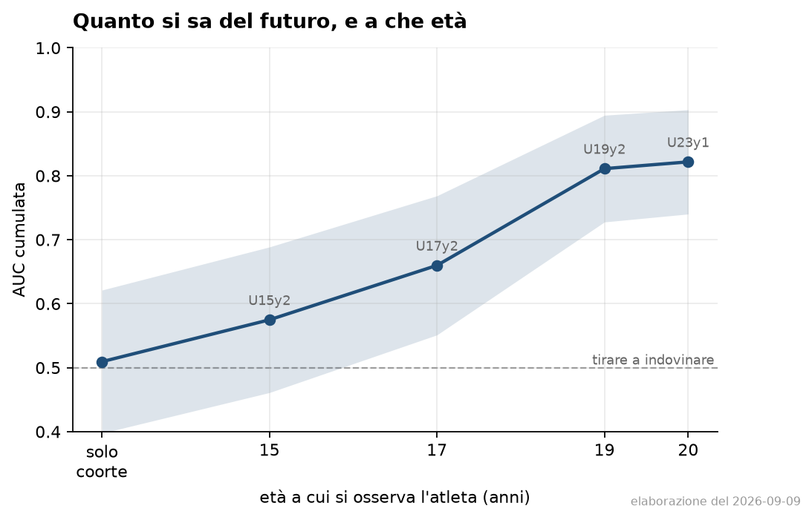

*Ogni punto aggiunge una categoria alla precedente, sugli stessi 102 atleti. La banda è l'intervallo di confidenza al 95% dell'AUC.*

L'ultimo passo merita attenzione: **M4 (+U23y1)** migliora l'adattamento del modello in modo netto (p = 0,002 al test di verosimiglianza), ma non migliora in modo distinguibile la capacità di ordinare gli atleti (ΔAUC +0,011, p = 0,641 al test di DeLong). Non è una contraddizione: il rendimento in Under 23 aiuta a stimare *quanto* è probabile che uno arrivi, ma su chi è già arrivato fin lì non cambia quasi più *chi* mettere davanti. L'informazione utile per distinguere è già stata spesa prima.

> **Come vanno lette queste AUC.** Non accanto a quelle dei modelli per singola categoria. Lì il campione erano tutti gli atleti presenti in una cella; qui è chi è arrivato fino all'Under 23 restando in classifica, e fra loro i professionisti sono il 43,1%. Su un gruppo già scremato distinguere è più difficile, e infatti i numeri sono più bassi. Di questa tabella conta la **differenza fra righe**, non il livello.

*Una riserva che si è rivelata infondata, e vale la pena dirlo.* Il sospetto era che il salto in Under 19 fosse un artefatto dello strumento: se il ranking nazionale non contasse le gare internazionali, chi corre all'estero vi risulterebbe più debole di quanto sia, e le categorie non sarebbero confrontabili fra loro. La verifica dice il contrario — il regolamento della fonte prevede le gare all'estero in tutte le categorie, e dagli Juniores in su le pesa di più: 15 punti per la vittoria in una gara internazionale contro i 10 di una nazionale e i 5 di una regionale. Lo strumento è lo stesso lungo tutto il percorso e il salto resta.

La riserva però non si chiude del tutto, ed è giusto dire dove resta aperta. I risultati ottenuti all'estero entrano in classifica **solo se il corridore li segnala**, mandando alla fonte copia dell'ordine di arrivo: sono previsti, non raccolti d'ufficio. Chi corre molto fuori dall'Italia ha quindi tutto l'interesse a farlo, e presumibilmente lo fa, ma la copertura delle gare internazionali dipende da un'iniziativa individuale e non da una procedura.

Resta infine un limite diverso, che non si corregge ma si dichiara: chi corre stabilmente all'estero senza gare in Italia non compare affatto in classifica, e non vi compare nemmeno chi è tesserato per una società straniera. È un problema di copertura della popolazione, non di confrontabilità delle misure.

## Se il ranking si usasse per selezionare

Fin qui si è misurato quanto il rendimento giovanile predice. Questa sezione traduce la misura in ciò che una società si trova davanti: se si guardassero solo gli atleti sopra una certa soglia, **quanti futuri professionisti si intercetterebbero, e quanti dei selezionati non lo diventeranno**.

> **Come si misura — Sensibilità, specificità e valori predittivi**
>
> Fissata una soglia, ogni atleta cade in una di quattro caselle: selezionato e diventato professionista, selezionato e no, non selezionato e diventato professionista, non selezionato e no.
>
> La **sensibilità** è la quota di futuri professionisti che finisce dentro la selezione: quanti non ne perdo. Il **valore predittivo positivo** è la quota di selezionati che diventerà professionista: quanti ne prendo a vuoto.
>
> Il **valore predittivo negativo** è la quarta casella letta dall'altra parte: fra gli scartati, quanti davvero non sarebbero arrivati. Con un esito raro è sempre altissimo, e proprio per questo non va usato come prova che la selezione funzioni: dire che il 99% degli scartati non ce l'avrebbe fatta è quasi una tautologia, visto che non ce la fa il 97% di chiunque. Serve però a rendere leggibile l'altra metà del compromesso, ed è una metrica che nessuno studio basato sui risultati di gara riporta: l'unico, fra quelli letti per questo progetto, che la riporta è Valenzuela 2023, e parte da un test di laboratorio su 65 Under 23 già selezionati.
>
> I due numeri non sono simmetrici, e la differenza dipende da quanto l'esito è raro. Se i professionisti sono il 3% della coorte, anche una selezione molto buona resta composta in gran parte da persone che non lo diventeranno: è aritmetica della base, non un difetto del criterio. È la stessa ragione per cui uno screening accurato su una malattia rara produce molti falsi allarmi.
>
> La **soglia di Youden** è quella che massimizza sensibilità + specificità - 1. Serve da riferimento, ma le soglie di capienza — il migliore 10%, il migliore 25% — sono quelle che corrispondono a una decisione reale.
>
> Approfondimenti: [Sensibilità e specificità](https://en.wikipedia.org/wiki/Sensitivity_and_specificity) · [Valore predittivo positivo](https://en.wikipedia.org/wiki/Positive_and_negative_predictive_values) · [Indice di Youden](https://en.wikipedia.org/wiki/Youden%27s_J_statistic)

| cella | criterio | soglia | selezionati | di cui pro | a vuoto | intercettati | successo dei selezionati | scartati che non arrivano |
|---|---|---|---|---|---|---|---|---|
| U15y1 | Youden | 52,6 | 802 | 50 | 752 | 85% | 6% | 99,0% |
| U15y1 | migliore 10% | 90,1 | 168 | 19 | 149 | 32% | 11% | 97,4% |
| U15y1 | migliore 25% | 75,2 | 420 | 32 | 388 | 54% | 8% | 97,9% |
| U15y2 | Youden | 83,1 | 304 | 41 | 263 | 65% | 13% | 98,5% |
| U15y2 | migliore 10% | 90,1 | 179 | 31 | 148 | 49% | 17% | 98,0% |
| U15y2 | migliore 25% | 75,1 | 447 | 42 | 405 | 67% | 9% | 98,4% |
| U17y1 | Youden | 80,6 | 182 | 44 | 138 | 71% | 24% | 97,6% |
| U17y1 | migliore 10% | 90,2 | 93 | 30 | 63 | 48% | 32% | 96,2% |
| U17y1 | migliore 25% | 75,5 | 232 | 45 | 187 | 73% | 19% | 97,6% |
| U17y2 | Youden | 78,7 | 344 | 59 | 285 | 82% | 17% | 99,0% |
| U17y2 | migliore 10% | 90,1 | 161 | 39 | 122 | 54% | 24% | 97,7% |
| U17y2 | migliore 25% | 75,1 | 401 | 59 | 342 | 82% | 15% | 98,9% |
| U19y1 | Youden | 85,8 | 103 | 41 | 62 | 60% | 40% | 95,5% |
| U19y1 | migliore 10% | 90,3 | 71 | 35 | 36 | 51% | 49% | 94,8% |
| U19y1 | migliore 25% | 75,4 | 176 | 43 | 133 | 63% | 24% | 95,2% |
| U19y2 | Youden | 78,0 | 201 | 61 | 140 | 82% | 30% | 98,1% |
| U19y2 | migliore 10% | 90,3 | 91 | 44 | 47 | 59% | 48% | 96,3% |
| U19y2 | migliore 25% | 75,3 | 226 | 61 | 165 | 82% | 27% | 98,1% |
| U23y1 | Youden | 78,2 | 33 | 25 | 8 | 49% | 76% | 75,0% |
| U23y1 | migliore 10% | 92,0 | 14 | 13 | <5 | 25% | 93% | 69,1% |
| U23y1 | migliore 25% | 76,7 | 35 | 25 | 10 | 49% | 71% | 74,5% |

*1 cella/e con meno di 5 atleti sono mascherate · La soglia è un percentile della cella. Sensibilità: quota di futuri professionisti dentro la selezione. Valore predittivo positivo: quota di selezionati che diventerà professionista.*

Il caso migliore è **U19y2**: selezionando il 10% più forte di quella categoria — 91 atleti su 901 — si intercetta il **59% dei futuri professionisti**, ma il **52% dei selezionati non lo diventerà**. Entrambe le metà della frase sono vere, e citarne una sola è il modo più comune di usare male questi dati.

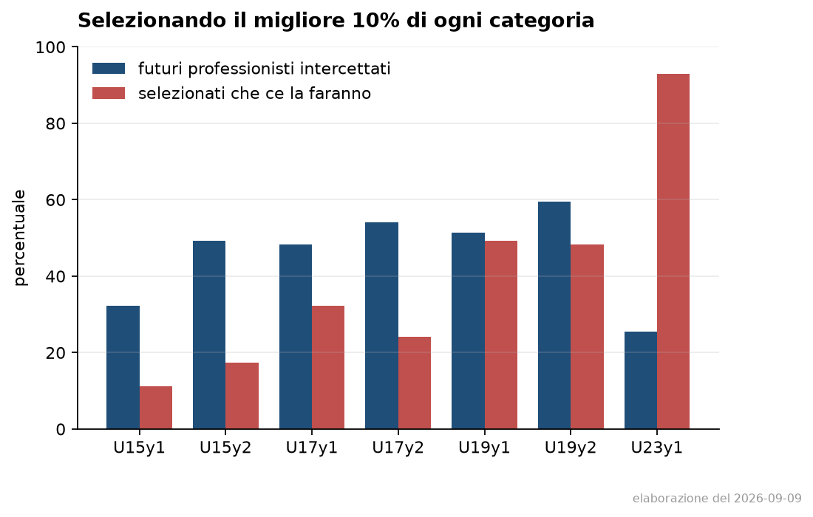

*Le due barre rispondono a due domande diverse. La prima: quanti dei futuri professionisti finiscono nella selezione. La seconda: quanti dei selezionati lo diventeranno. Salgono insieme solo in apparenza.*

> **Attenzione a leggere la colonna del successo dei selezionati come una misura di bravura del criterio.** Cresce con l'età soprattutto perché cresce la quota di professionisti nella cella: in Under 23 chi è ancora in classifica ha già superato tre selezioni. Un criterio applicato a un gruppo già scremato sembra più preciso senza esserlo di più.

## Quando si diventa professionisti

Tutte le sezioni precedenti chiedono **chi** arriverà al professionismo. Questa chiede **quando**, e la risposta è una curva sull'età invece che un numero. È anche l'unica che usa le coorti recenti: chi non ha ancora completato la finestra dei venticinque anni contribuisce le stagioni già osservate e poi esce dal conteggio, e questo porta gli eventi utilizzabili da 77 a **121**.

> **Come si misura — Modello di sopravvivenza a tempo discreto**
>
> I dati si riorganizzano in **stagioni a rischio**: una riga per ogni atleta e per ogni stagione in cui poteva diventare professionista e non lo era ancora. Chi lo diventa esce dal rischio, chi non ha ancora finito la finestra viene **censurato** — cioè contribuisce le stagioni osservate senza che il silenzio successivo venga scambiato per un no.
>
> Su questa tabella si stima la probabilità che l'evento accada in una data stagione. Il legame usato è il **complementare log-log**, che discende da un processo continuo osservato a intervalli: la decisione di ingaggiare un corridore matura in un momento qualunque dell'anno, noi la vediamo per stagione. Il suo coefficiente si legge come rapporto fra rischi.
>
> Gli errori standard sono **raggruppati per atleta**: le stagioni dello stesso corridore non sono osservazioni indipendenti, e ignorarlo restringerebbe gli intervalli di confidenza di una quantità arbitraria.
>
> Il predittore è il percentile della stagione **precedente**. Usare quello della stagione in corso significherebbe spiegare una decisione con informazione che al momento di prenderla non esisteva ancora.
>
> Approfondimenti: [Analisi di sopravvivenza](https://en.wikipedia.org/wiki/Survival_analysis) · [Censura](https://en.wikipedia.org/wiki/Censoring_(statistics)) · [Legame complementare log-log](https://en.wikipedia.org/wiki/Generalized_linear_model#Link_function)

| età | atleti a rischio | passaggi al professionismo | per mille |
|---|---|---|---|
| 19 | 5604 | 16 | 2,9 |
| 20 | 5185 | 13 | 2,5 |
| 21 | 4735 | 33 | 7,0 |
| 22 | 4245 | 29 | 6,8 |
| 23 | 3754 | 30 | 8,0 |

*una riga per stagione a rischio; chi diventa professionista esce dal rischio, chi non ha ancora finito la finestra dei venticinque anni è censurato*

**Prima dei 19 anni la casella è vuota, e non per caso**: il regolamento internazionale non permette di correre da professionista prima. Il rischio poi cresce, e il massimo osservato cade a 23 anni.

*La finestra si ferma a 23 anni perché lì finisce il predittore: il ranking giovanile arriva all'Under 23 e oltre non esiste più alcuna classifica nazionale da cui misurare il rendimento. I 10 passaggi al professionismo avvenuti dopo restano fuori dal modello, ed è meglio dichiararlo che includerli trattando un dato mancante come un'assenza.*

### Cosa sposta il rischio

| variabile | rapporto fra rischi | IC 95% | p |
|---|---|---|---|
| dieci punti di percentile in più | 1,776 | 1,553-2,030 | < 0,001 |
| assente dalla classifica l'anno prima | 0,049 | 0,026-0,093 | < 0,001 |
| un anno di nascita più recente | 1,022 | 0,954-1,095 | 0,535 |

*n = 23 523 · errori standard raggruppati per atleta: le stagioni dello stesso corridore non sono osservazioni indipendenti*

Il coefficiente che domina non è il rendimento: è **il restare nella popolazione osservata**. Chi non era in classifica l'anno precedente ha un rischio pari a 0,049 di chi c'era, cioè circa **20 volte più basso**. Fra chi c'è, dieci punti di percentile in più moltiplicano il rischio per 1,78.

Va letto con la cautela che merita. Le sezioni precedenti hanno mostrato che sparire dalla classifica significa smettere di fare punti, non smettere di correre, e che al cambio di categoria il posto in lista sparisce per ragioni che riguardano la lunghezza della classifica. Questo coefficiente misura quindi in buona parte **quanto è difficile rientrare** una volta usciti dal gruppo osservato, non quanto sia compromessa la carriera di chi esce.

Un dato di contesto che rende la cifra meno sorprendente: su cento stagioni a rischio, in 87 casi l'atleta **non** era in classifica l'anno prima. La classifica Under 23 ha poche decine di posti, quindi l'assenza è la condizione normale e non l'eccezione.

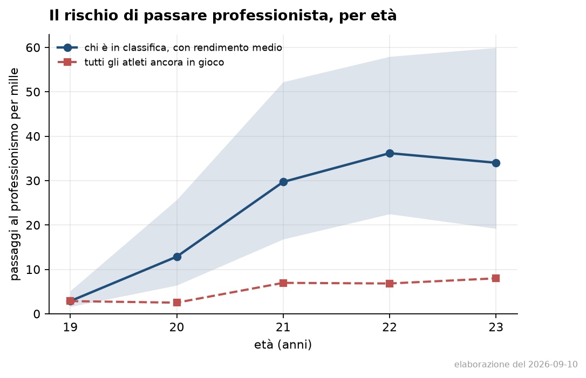

*La distanza fra le due curve è quanto pesa l'essere ancora nella classifica nazionale: a parità di età, chi c'è ha un rischio molte volte maggiore.*

Messo in forma leggibile: per un atleta che resta in classifica **ogni** stagione fino ai 23 anni, la probabilità di arrivare al professionismo vale **11,1%** con un rendimento nella media della classifica, sale a **30,9%** con 20 punti di percentile in più e scende a **3,7%** con 20 punti in meno.

> **Attenzione al condizionamento.** Queste probabilità valgono per chi resta in classifica tutti gli anni, che è una minoranza molto selezionata: non sono la probabilità di un ragazzo qualunque che comincia a correre. Quella resta quella dell'imbuto, di gran lunga più bassa.

> **Un controllo che vale la pena riportare.** L'anno di nascita non sposta il rischio (rapporto 1,022, p = 0,535). Le tredici coorti qui incluse si comportano allo stesso modo, il che vuol dire che i risultati non dipendono da quale periodo si guardi — ed è la stessa conclusione a cui era arrivato, per un'altra strada, il modello per singola categoria.

## Conta il livello o il miglioramento?

Un ragazzo che passa dal quarantesimo al novantesimo percentile in tre anni è più promettente di uno stabile al settantacinquesimo? È la domanda che in società si fa più spesso, ed è l'unica di questo studio a cui i dati longitudinali possono rispondere direttamente.

> **Come si misura — Modello misto e traiettorie individuali**
>
> A ogni atleta si adatta una retta: il suo percentile in funzione dell'età. Due numeri riassumono la traiettoria — il **livello**, cioè dove passa la retta a metà del percorso giovanile, e la **pendenza**, cioè quanto sale o scende ogni anno.
>
> Non si fa una regressione separata per ciascun atleta: chi ha due sole stagioni avrebbe una pendenza stimata su due punti, cioè rumore. Il modello misto stima tutte le rette insieme e applica lo **shrinkage** — le stime individuali vengono tirate verso la media della popolazione tanto più quanto meno dati ha quell'atleta. È il comportamento corretto e viene fuori da solo dalla struttura del modello, ma va saputo: le pendenze di chi ha poche stagioni sono poco individuali.
>
> La finestra si ferma a 18 anni. Oltre comincia l'Under 23, dove alcuni atleti sono già professionisti: includere quelle stagioni significherebbe prevedere l'esito con osservazioni raccolte dopo che l'esito si è verificato.
>
> Livello e pendenza entrano **sempre insieme** nel modello, perché sono correlati per costruzione: il percentile ha un soffitto a 100, quindi chi parte alto ha meno spazio per salire. Nei dati quella correlazione vale -0,15.
>
> Approfondimenti: [Modelli a effetti misti](https://en.wikipedia.org/wiki/Mixed_model) · [Shrinkage](https://en.wikipedia.org/wiki/Shrinkage_(statistics)) · [BLUP](https://en.wikipedia.org/wiki/Best_linear_unbiased_prediction)

Le traiettorie sono stimate su **7 595 osservazioni** di 2 743 atleti, ma le stagioni osservate per atleta sono poche e molto diseguali.

| stagioni osservate | atleti |
|---|---|
| 1 | 840 |
| 2 | 619 |
| 3 | 429 |
| 4 | 336 |
| 5 | 228 |
| 6 | 291 |

*lo shrinkage del modello misto tira verso la media le traiettorie stimate su poche stagioni: è corretto, ma va saputo che molte pendenze sono poco individuali*

Il modello dell'esito gira sui 1 903 atleti con almeno 2 stagioni osservate, fra cui 74 professionisti: sotto le due stagioni la pendenza individuale non esiste e lo shrinkage la riporta esattamente alla media, quindi quelle righe non porterebbero informazione sulla domanda che si sta facendo.

| variabile | odds ratio | IC 95% | p |
|---|---|---|---|
| livello: dieci punti di percentile in più | 3,03 | 2,51-3,71 | < 0,001 |
| pendenza: una deviazione standard di miglioramento annuo | 3,35 | 2,54-4,51 | < 0,001 |

*n = 1 903 · le due variabili entrano sempre insieme: sono correlate per costruzione, perché il percentile ha un soffitto a 100 e chi parte alto ha meno spazio per salire*

**Contano tutti e due, e il miglioramento aggiunge parecchio.** Un modello che conosce solo il livello arriva a un'AUC di 0,848; aggiungendo la pendenza sale a 0,919, cioè +0,071 in più (p = < 0,001 al test di DeLong). Non è informazione ridondante: sapere dove sta andando un atleta dice qualcosa che il suo livello attuale non dice.

### La stessa risposta senza coefficienti

| livello | miglioramento | atleti | professionisti | % pro |
|---|---|---|---|---|
| basso | basso | 88 | 1 | 1,1 |
| basso | medio | 250 | 0 | 0,0 |
| basso | alto | 297 | 2 | 0,7 |
| medio | basso | 214 | 0 | 0,0 |
| medio | medio | 234 | 2 | 0,9 |
| medio | alto | 186 | 11 | 5,9 |
| alto | basso | 333 | 7 | 2,1 |
| alto | medio | 150 | 20 | 13,3 |
| alto | alto | 151 | 31 | 20,5 |

*terzili delle due dimensioni; il gradiente corre in entrambe le direzioni, che è il modo più diretto di dire che contano tutte e due; la colonna dei professionisti non è mascherata perché il conteggio si ricava comunque dalla percentuale e dal numero di atleti della stessa riga*

Il gradiente corre in **entrambe** le direzioni, ma non allo stesso modo. Nel terzo di atleti con il livello più alto, chi stava anche migliorando è diventato professionista nel 20,5% dei casi, chi stava peggiorando nel 2,1%: quasi dieci volte tanto, a parità di livello. Il salto non è però distribuito lungo la riga: quasi tutto sta fra chi calava e chi teneva, perché la cella di mezzo vale già il 13,3%. Nel terzo con livello medio e miglioramento alto si arriva al 5,9%, più che nel terzo con livello alto e pendenza in calo — con la cautela che sono tassi di due gruppi diversi e non due atleti messi uno contro l'altro.

Nel terzo con il livello più basso, invece, il miglioramento non salva quasi nessuno. **Il livello è una condizione, il miglioramento è un moltiplicatore**: senza il primo il secondo non basta, ma con il primo il secondo cambia molto.

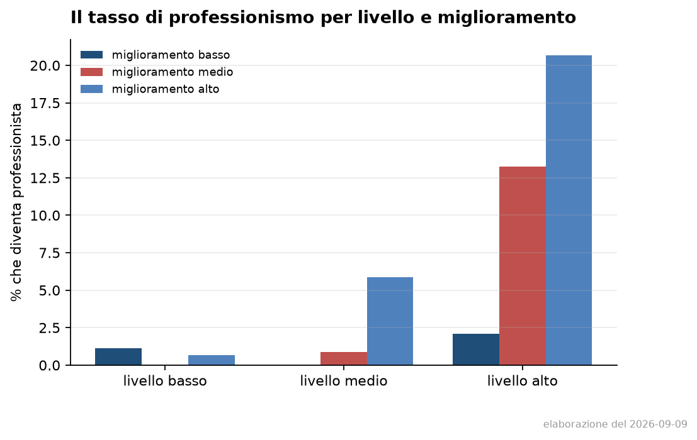

*Il miglioramento da solo non basta — a sinistra le barre restano schiacciate qualunque sia il colore — e il livello da solo nemmeno: è a destra, dove le due cose coincidono, che il tasso si impenna.*

### Non sarà di nuovo la durata della carriera?

La sezione sulla mobilità ha mostrato che un gradiente vistoso può essere la durata della carriera vista da un'altra angolazione. Qui il sospetto è fondato per un motivo tecnico preciso: lo shrinkage rende meno estreme le pendenze di chi ha poche stagioni, quindi una pendenza marcata è anche un indizio di carriera lunga.

| stagioni osservate | pendenza media in valore assoluto |
|---|---|
| 2 | 1,58 |
| 3 | 2,34 |
| 4 | 3,32 |
| 5 | 3,67 |
| 6 | 3,18 |

*chi ha poche stagioni riceve una pendenza vicina alla media della popolazione: è il comportamento corretto del modello misto, non un difetto, ma va saputo*

Il controllo si fa aggiungendo al modello il numero di stagioni osservate: l'odds ratio della pendenza passa da 3,35 a 3,09. Si riduce, ma resta grande. **Questa volta il gradiente non sembra essere solo un travestimento della durata della carriera** — il numero di stagioni è una misura sola di quella durata, quindi il sospetto si ridimensiona invece di sparire.

Il numero di stagioni non entra però nel modello principale, e per la stessa ragione per cui non ci entrano società e regione: chi va meglio resta di più, quindi la durata sta sul percorso causale fra rendimento ed esito. Metterla fra i controlli sottrarrebbe una parte dell'effetto che si vuole misurare. La si usa come verifica, non come aggiustamento.

## Non solo se si arriva, ma fino a dove

Fin qui il professionismo è stato trattato come una porta: dentro o fuori. Ma fra i professionisti c'è chi corre qualche stagione in una squadra di seconda divisione e chi entra fra i primi cento al mondo. La domanda di questa sezione è se il rendimento giovanile dica qualcosa anche su **quanto lontano** si arriva.

| livello raggiunto | atleti |
|---|---|
| non professionista | 1590 |
| professionista | 68 |
| top 500 | 57 |
| top 100 | 15 |

*n = 1 730 · solo gli atleti presenti nella classifica Under 19 secondo anno, che comprendono 140 dei 145 professionisti delle coorti*

> **Come si misura — Regressione ordinale e odds proporzionali**
>
> I quattro livelli non sono categorie qualsiasi: sono gradini di un'unica scala. La regressione ordinale ne tiene conto e stima **un solo coefficiente** per tutta la scala, invece di uno per ogni confronto. Usa tutta l'informazione e non spezza il campione.
>
> Il prezzo è un'assunzione: che l'effetto del predittore sia lo stesso su ogni gradino — gli **odds proporzionali**. Si controlla stimando le soglie una per una e confrontando i coefficienti. Se si somigliano, il coefficiente unico è un buon riassunto; se divergono, è una media che nasconde andamenti diversi.
>
> Il confronto fra le soglie sostituisce il **test di Brant**, che non è stato eseguito: con tre soglie e pochi eventi ai gradini alti un test formale avrebbe poca potenza, e guardare i coefficienti uno accanto all'altro dice la stessa cosa in modo più leggibile. Vale come ispezione, non come verifica formale.
>
> Il predittore è il percentile in Under 19 secondo anno. La guida propone di usare anche l'Under 23, ma in quelle coorti la classifica Under 23 contiene poche centinaia di atleti già selezionatissimi: chiederli entrambi reintrodurrebbe proprio il problema di selezione che il modello ordinale serve a evitare.
>
> Approfondimenti: [Regressione ordinale](https://en.wikipedia.org/wiki/Ordinal_regression) · [Odds proporzionali](https://en.wikipedia.org/wiki/Ordered_logit) · [Odds ratio](https://en.wikipedia.org/wiki/Odds_ratio)

Il modello ordinale dice che **dieci punti di percentile in Under 19 moltiplicano per 2,50** l'odds di salire di livello sulla scala (IC 95% 2,15-2,90, p < 0,001).

| soglia | casi | odds ratio | IC 95% |
|---|---|---|---|
| almeno professionista | 140 | 2,46 | 2,14-2,89 |
| almeno top 500 | 72 | 2,74 | 2,21-3,53 |
| almeno top 100 | 15 | 3,67 | 2,09-8,20 |

*se il modello ordinale è appropriato questi tre coefficienti devono somigliarsi: è il controllo dell'assunzione di odds proporzionali*

I tre coefficienti crescono salendo di soglia, ma restano dello stesso ordine — il più grande è 1,49 volte il più piccolo — e gli intervalli si sovrappongono ampiamente. L'assunzione di odds proporzionali regge abbastanza da poter riportare un coefficiente unico, tenendo presente che la soglia più alta poggia su quindici casi.

### Dove il rendimento giovanile smette di contare

Le soglie qui sopra confrontano chi ha raggiunto un livello con **tutti gli altri**, professionisti mancati compresi: ereditano quindi il segnale del primo gradino. Per sapere se il rendimento giovanile conti anche *dentro* il gruppo di chi ce l'ha fatta bisogna chiedere un'altra cosa — fra i professionisti, chi arriva al top 500? E fra questi, chi al top 100?

| passaggio | chi ci prova | chi ci riesce | odds ratio | IC 95% |
|---|---|---|---|---|
| diventare professionista | 1730 | 140 | 2,47 | 2,14-2,89 |
| entrare nel top 500, fra i professionisti | 140 | 72 | 1,20 | 0,98-1,52 |
| entrare nel top 100, fra i top 500 | 72 | 15 | 1,28 | 0,82-2,56 |

*ogni riga è condizionata alla precedente: il secondo coefficiente vale fra i professionisti, il terzo fra i top 500*

**Il rendimento in Under 19 predice l'ingresso e quasi nulla di ciò che viene dopo.** Per diventare professionista l'odds ratio è 2,47; per arrivare al top 500 **fra i professionisti** scende a 1,20, e per il top 100 fra i top 500 a 1,28. In entrambi i casi l'intervallo di confidenza comprende l'uno: su questi numeri non si distingue dal caso.

È il risultato più interessante della sezione, e conviene dirlo con le parole giuste. Non significa che fra i professionisti il talento non conti, e nemmeno che la soglia sia una sola: la sezione «Da quale porta si entra» mostra che l'ingresso avviene per due vie con esiti molto diversi. Significa che **la classifica giovanile italiana non lo misura più**. A diciotto anni distingue bene chi entrerà nel professionismo da chi no; una volta dentro, quello che decide se si arriva fra i primi cento al mondo è qualcosa che quella classifica non ha registrato.

### La catena delle probabilità

| percentile in Under 19 | professionista | almeno top 500 | top 100 |
|---|---|---|---|
| 50° | 1,1% | 0,4% | 0,04% |
| 75° | 10,0% | 4,6% | 0,73% |
| 90° | 30,0% | 15,8% | 3,40% |

*probabilità composta lungo i tre stadi; sono previsioni del modello, non frequenze osservate*

In una frase sola: **un atleta al 90° percentile della classifica Under 19 ha circa il 30% di probabilità di diventare professionista e il 16% di arrivare almeno nel top 500 mondiale**; uno al 50° percentile ha rispettivamente 1,1% e 0,4%.

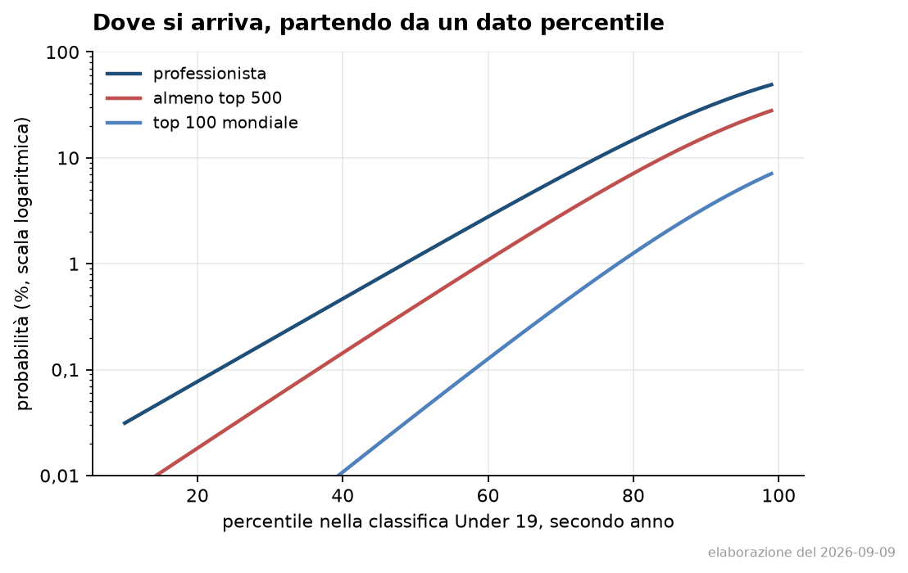

*Le tre curve restano quasi parallele: salendo di percentile aumentano insieme, il che vuol dire che il rendimento giovanile sposta la probabilità di entrare, non quella di andare lontano una volta entrati.*

> **Il modello con anche l'Under 23, per completezza.** Sui 214 atleti presenti in entrambe le classifiche, l'Under 19 vale 1,55 e l'Under 23 1,25. Sono valori molto più bassi di quelli dell'analisi principale, e non perché il rendimento conti meno: quel sottocampione è fatto di sopravvissuti fra loro simili, e su un gruppo già scremato ogni predittore sembra più debole. È la ragione per cui questo modello resta secondario.

> **Un limite da tenere presente.** Il livello più alto poggia su quindici atleti. Bastano due o tre casi in più o in meno per spostare i coefficienti dell'ultimo gradino, e infatti i suoi intervalli di confidenza sono larghissimi. Le conclusioni robuste di questa sezione riguardano il primo gradino; sugli altri si può dire soprattutto che **non si vede** un effetto, che non è la stessa cosa che dire che non c'è.

## Da quale porta si entra

La sezione precedente ha trovato che il rendimento Under 19 predice l'ingresso nel professionismo e quasi nulla di ciò che viene dopo, e lo ha spiegato dicendo che la classifica giovanile smette di misurare qualcosa oltre quella soglia. C'è però una spiegazione alternativa che merita di essere messa alla prova: le squadre professionistiche italiane hanno bisogno di corridori italiani, e i migliori juniores nazionali sono il bacino da cui pescano. Se fosse così, il ranking predirebbe l'ingresso perché ordina bene quel bacino, non perché misuri il valore assoluto di un atleta.

> **Come si misura — Come si riconosce una squadra italiana, e con quale approssimazione**
>
> La nazionalità di registrazione delle squadre non è fra i dati raccolti, ma le rose sì: una squadra la cui rosa è per metà o più italiana è con ottima approssimazione una squadra italiana, e il controllo a campione restituisce esattamente i nomi che ci si aspetta.
>
> È un **proxy**: nessuna delle conclusioni che seguono dipende da un singolo caso limite, ma la classificazione non è un dato ufficiale. Dei 370 professionisti di cui si conosce la squadra al debutto, 72 non sono classificabili perché la rosa di quella squadra non è fra quelle scaricate.
>
> Quando un corridore compare in più squadre nella stagione del debutto si tiene quella di livello più alto.

La prima cosa da guardare è quanto sia grande quella porta. Nelle squadre a maggioranza italiana i corridori italiani in rosa sono passati da 62 nel 2015 a 35 nel 2025.

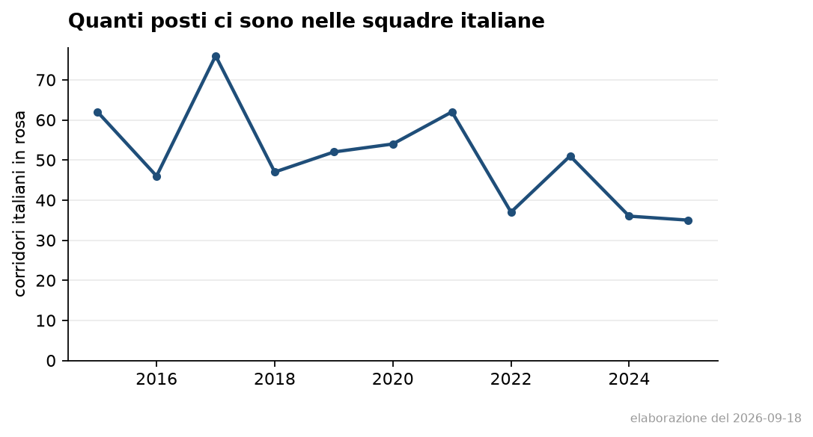

*La porta principale del professionismo italiano si è ristretta di circa un terzo in dieci anni. È un conteggio delle rose, non dei posti che si liberano: quelli sono molti di meno.*

### Il test discriminante

Se il ranking misurasse soprattutto «il migliore fra gli italiani», dovrebbe predire l'ingresso in una squadra italiana molto meglio dell'ingresso in una squadra straniera, dove la concorrenza non è nazionale. Le due previsioni si calcolano sulla stessa popolazione e con lo stesso predittore.

| diventare professionista… | casi | quanto il percentile Under 19 li distingue |
|---|---|---|
| in una squadra a maggioranza italiana | 160 | 0,863 |
| in una squadra internazionale | 105 | 0,867 |

*stessa popolazione, 3873 atleti in classifica al secondo anno da Juniores; il valore è la probabilità che il modello metta davanti quello giusto*

**La versione forte dell'ipotesi non regge.** Il percentile Under 19 distingue chi entrerà in una squadra italiana con 0,863 e chi entrerà in una squadra straniera con 0,867: praticamente lo stesso valore. Se il ranking fosse soltanto una graduatoria del bacino nazionale, la seconda cifra dovrebbe essere molto più bassa. Quello che misura, qualunque cosa sia, interessa anche a chi non ha bisogno di italiani.

### Ma le due porte non portano allo stesso posto

| porta d'ingresso | professionisti | arrivati nel top 500 | quota | il percentile Under 19 li distingue |
|---|---|---|---|---|
| italiana | 160 | 53 | 33,1% | 0,582 |
| internazionale | 105 | 62 | 59,0% | 0,651 |

*l'ultima colonna è calcolata fra i soli professionisti di quel gruppo: dice se il rendimento giovanile aiuti a capire chi andrà lontano una volta entrato*

**Qui invece l'ipotesi trova il suo sostegno.** Di chi debutta in una squadra a maggioranza italiana arriva nel top 500 mondiale il 33,1%; di chi debutta in una squadra straniera, il 59,0%. La stessa soglia, due destini molto diversi.

Ne segue una lettura più precisa del risultato della sezione precedente. Non è che il rendimento giovanile smetta di contare oltre la soglia del professionismo: è che **la soglia non è una sola**. Passare dalla porta italiana e passare da quella internazionale sono due eventi diversi, con esiti diversi, e il ranking li predice entrambi allo stesso modo. Mettendoli insieme in un unico esito «professionista», una parte della capacità predittiva si perde per costruzione.

Dentro ciascun gruppo, poi, il rendimento giovanile aiuta poco a capire chi andrà lontano: 0,582 fra chi è entrato da una squadra italiana e 0,651 fra chi è entrato da una straniera, dove 0,5 significa tirare a indovinare. Su questi numeri sono indicazioni, non stime: i due gruppi contano 160 e 105 professionisti.

> **Cosa resta non verificato.** Questa sezione dice che la squadra con cui si debutta si accompagna a carriere diverse, e la classifica per nazionalità la ricava dalla composizione delle rose. Non misura *quanto* di quella differenza dipenda dalla nazionalità e quanto dal valore dell'atleta: per farlo servirebbe confrontare corridori italiani e stranieri a parità di rendimento giovanile, e i ranking giovanili degli altri paesi non sono nei dati. Resta anche possibile che la differenza fra le due porte non dipenda dalla porta ma da chi la sceglie: chi è più forte va all'estero, e sarebbe arrivato lontano comunque.

## Le ragazze

Tutto il resto di questo documento riguarda i maschi, e la ragione non è una scelta di merito: gli esiti di carriera femminili non erano stati raccolti, quindi ogni domanda che finisca con «e poi chi ce l'ha fatta?» restava senza risposta. Molte domande però non hanno bisogno di un esito, e su quelle il femminile si studia eccome.

| categoria | atlete | atleti | rapporto | gare per stagione, femminili | maschili | rapporto fra le gare |
|---|---|---|---|---|---|---|
| Esordienti | 864 | 6 356 | 7,4× | 77 | 639 | 8,3× |
| Allievi | 722 | 6 195 | 8,6× | 65 | 414 | 6,4× |
| Juniores | 389 | 4 181 | 10,7× | 35 | 282 | 8,1× |

*atlete e atleti distinti su tutte le stagioni disponibili; le gare sono stimate dai piazzamenti nei primi cinque, cinque per gara; in Esordienti il rapporto fra le gare non si confronta con le altre righe, perché il conteggio maschile somma i due calendari, uno per annata, e quello femminile ne conta uno solo fino al 2021*

Il movimento femminile è più piccolo di quello maschile di circa **7,4 volte** in Esordienti. Le gare invece si confrontano solo dove la classifica è una lista unica per entrambi i sessi, cioè in Allievi e Juniores, e lì sono da **6,4 a 8,1 volte** meno: le ragazze non sono semplicemente meno, corrono anche molto meno spesso. Il rapporto degli Esordienti è più alto ma non va preso alla lettera, perché il conteggio maschile somma da sempre due calendari, uno per annata, e quello femminile solo dal 2022.

### Un cambio di regolamento che vale un esperimento

La sezione sui posti ha mostrato che dove le due annate condividono la classifica il primo anno ne vince una minoranza, e ha usato come controllo il confronto fra categorie maschili. Le Esordienti femminili permettono un controllo molto più stretto, perché la fonte ha **cambiato struttura in corsa**: fino al 2021 una classifica sola, dal 2022 due separate.

| struttura della classifica | stagioni | atlete al primo anno | quota dei posti, primo anno | secondo anno |
|---|---|---|---|---|
| classifica unica | 2011-2021 | 295 | 28,5% | 71,5% |
| classifiche separate | 2022-2025 | 217 | 49,6% | 50,4% |

*Esordienti femminili: la fonte ha separato le due classifiche dal 2022, e prima ne pubblicava una sola*

**Stessa categoria e stesse età, in due periodi diversi e quindi con ragazze diverse: cambia la struttura della lista, e il primo anno passa dal 28,5% al 49,6% dei posti.** Dei due numeri è il primo a portare l'informazione: con le liste separate ogni annata ha i propri posti, e la metà è quasi automatica. Con la lista condivisa, invece, il primo anno ne prende poco più di un quarto, lo stesso ordine del 26,7% degli Allievi maschi. Il confronto è più stretto di quello fra categorie maschili, perché categoria ed età restano le stesse: dove le annate condividono la classifica, il primo anno non sparisce perché ci siano meno posti, ma perché quei posti li vincono le più grandi.

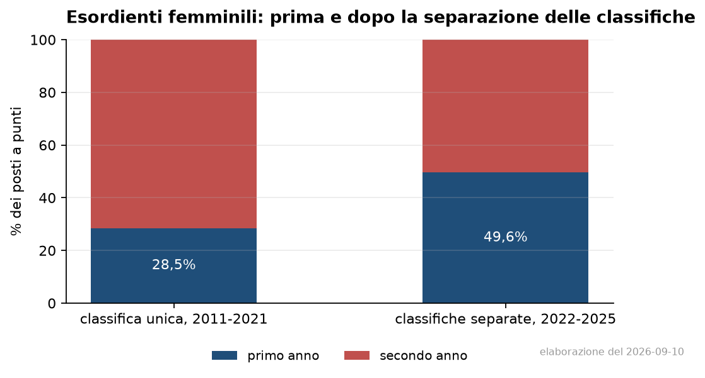

*Stessa categoria e stesse età, prima e dopo la separazione delle liste: con la lista condivisa il primo anno prende poco più di un quarto dei posti, con le liste separate la metà, che lì è quasi automatica.*

### Le cose che non cambiano

| categoria | femminile | maschile |
|---|---|---|
| Esordienti | 42,6% | 39,7% |
| Allievi | 44,0% | 39,6% |
| Juniores | 41,0% | 44,9% |

*medie sulle stagioni; è la stessa misura della sezione sui posti*

La concentrazione dei punti è **dello stesso ordine nei due movimenti**: il decile migliore ne prende fra il 39,6% e il 44,9%, che è l'intervallo già visto confrontando le categorie maschili fra loro. Cambia tutto — la numerosità, il numero di gare, la struttura delle liste — e la forma della distribuzione resta molto simile.

Un'ultima differenza, e va nella direzione opposta a quella che ci si aspetterebbe. Il calendario maschile si è quasi dimezzato; quello femminile, nelle categorie che non hanno cambiato struttura, molto meno: in una categoria è cresciuto, nell'altra ha perso poco.

| categoria | gare nel 2011 | gare nel 2025 | variazione |
|---|---|---|---|
| Allievi | 76 | 67 | -11,6% |
| Juniores | 32 | 41 | +28,8% |

*le Esordienti restano fuori: separando le classifiche nel 2022 i posti raddoppiano per costruzione, e il confronto nel tempo non reggerebbe*

> **Cosa manca, e cosa servirebbe.** Nel periodo studiato la fonte non pubblica una classifica Under 23 femminile, anche se la categoria esiste nel regolamento federale e corre insieme alle Elite (Norme Attuative 2027, art. 11.5), quindi il predittore più vicino all'esito, quello che nel maschile porta quasi tutta l'informazione, qui non c'è. Gli esiti di carriera sono ora scaricati — 414 squadre-stagione e 5 580 righe di rosa, con 51 atlete italiane distinte nelle squadre di prima e seconda divisione fra il 2020 e il 2025 —, ma le divisioni professionistiche femminili nascono nel 2020: prima esisteva una categoria sola, quindi «professionista» non è definibile allo stesso modo e le coorti utilizzabili sono solo le più recenti. Finché quel nodo non è sciolto, questa sezione resta descrittiva.

## Quanto regge tutto questo

Un modello stimato su un campione e misurato sullo stesso campione si giudica da solo, e si giudica bene. Una parte della sua bravura è vera, un'altra è adattamento al rumore di quelle particolari righe, e guardando il numero le due non si distinguono. Questa sezione raccoglie le tre prove che servono a separarle.

### Quanti professionisti, e perché i conteggi non coincidono

Il numero di professionisti cambia da una sezione all'altra di questo documento, e la prima cosa che un lettore attento fa è provare a farlo tornare. Non torna, e non deve: ogni analisi ha la popolazione che la sua domanda consente. Questa tabella mette i conteggi uno accanto all'altro con il motivo di ciascuno, che è più utile di un numero unico ottenuto rinunciando a delle domande.

| analisi | coorti | atleti | professionisti | perché quel numero |
|---|---|---|---|---|
| accesso al professionismo | 1996-2000 | 2 813 | 77 | tutti i classificati delle coorti: è la popolazione dello studio |
| cosa aggiunge ogni categoria | 1996-2000 | 102 | 44 | solo chi è osservato in tutte le categorie, per confrontare i modelli sulle stesse persone |
| livello e miglioramento | 1996-2000 | 1 903 | 74 | serve più di una stagione per stimare una pendenza |
| qualità della carriera | 1992-2000 | 1 730 | 140 | coorti più larghe, perché i top 100 sono pochissimi, e solo chi compare in Under 19 secondo anno |
| quando si diventa professionisti | 1996-2008 | 5 604 | 121 | tutte le coorti disponibili, con censura: qui si contano gli eventi, non le persone |
| sensibilità sulle definizioni | 1996-2000 | 901 | da 26 a 151 | cambia cosa conta come professionismo, a parità di atleti |

Resta un settimo numero, e sta fuori da questa tabella perché non viene da una query: `docs/definizioni.md` congela **78 eventi PRO** per le coorti 1996-2000. Quel file compare nel primo commit del repository ed è stato scritto prima di guardare i dati, come impone la procedura (lo si può dichiarare, non dimostrare: il lavoro precedente al repository non lascia traccia), e prima della verifica manuale degli abbinamenti — diciotto date corrette, dieci atleti duplicati riuniti in uno solo. Il conteggio che si rigenera oggi è quello della prima riga, e ho provato a ricostruire da dove venga la differenza di uno senza riuscirci: nessuna delle correzioni manuali sposta un professionista dentro o fuori quelle coorti. La riporto così com'è invece di inventarle una causa.

*Nota sui confronti multipli.* Questo documento riporta decine di stime con il loro intervallo di confidenza e **non applica nessuna correzione** per la molteplicità dei confronti. È una scelta, e va saputa: gli intervalli vanno letti uno per uno, e un singolo p-value appena sotto la soglia convenzionale, in mezzo a tanti, non è una scoperta. I risultati su cui il documento si appoggia sono quelli che restano in piedi per ordine di grandezza, non per un decimale.

### Il modello si sta giudicando troppo bene?

> **Come si misura — Correzione dell'ottimismo e pendenza di calibrazione**
>
> Si ricampiona con reimmissione, si ristima il modello sul campione estratto e si misura la sua AUC due volte: sul campione che lo ha addestrato e sui dati originali. La differenza è l'**ottimismo** di quella ripetizione, e la media degli ottimismi si sottrae all'AUC apparente. È la procedura di Harrell, la stessa che usa `rms::validate`.
>
> La **pendenza di calibrazione** dice un'altra cosa: se le probabilità previste sono nella scala giusta. Vale 1 quando lo sono; meno di 1 quando il modello è troppo sicuro di sé, che è il sintomo tipico del sovradattamento.
>
> Approfondimenti: [Bootstrap](https://en.wikipedia.org/wiki/Bootstrapping_(statistics)) · [Calibrazione](https://en.wikipedia.org/wiki/Calibration_(statistics)) · [Overfitting](https://en.wikipedia.org/wiki/Overfitting)

| modello | atleti | eventi | AUC apparente | ottimismo | AUC corretta | pendenza di calibrazione |
|---|---|---|---|---|---|---|
| solo percentile Under 19 | 901 | 74 | 0,890 | 0,000 | 0,889 | 1,02 |
| livello e pendenza della traiettoria | 1903 | 74 | 0,919 | 0,001 | 0,917 | 1,01 |

*500 ricampionamenti; l'ottimismo è quanto il modello si giudica meglio di quanto sia, e va sottratto*

**L'ottimismo è praticamente nullo**: al massimo 0,001 punti di AUC, contro una soglia convenzionale di 0,05 oltre la quale un modello andrebbe semplificato. E le pendenze di calibrazione sono a ridosso di 1. Non è un caso fortunato: sono modelli con due o tre parametri stimati su centinaia di atleti, e a quel rapporto non c'è spazio per adattarsi al rumore.

È anche un argomento a favore della forma che questo studio ha scelto. La tentazione, con dati longitudinali su migliaia di persone, è costruire modelli ricchi; il prezzo sarebbe stato pagarlo qui.

#### Quel modello si stima in due tempi

C'è una cosa che la tabella qui sopra non misura, e riguarda la riga più importante. Livello e pendenza non sono osservati: sono stime prodotte dal modello misto, e per chi ha poche stagioni sono stime prudenti, tirate verso la media dallo shrinkage. Il ricampionamento appena descritto rifà ogni volta la logistica, ma **non** il modello misto, che gira una volta sola prima del ciclo: livello e pendenza entrano nel bootstrap come se fossero colonne osservate. L'ottimismo che ne esce è quindi quello del solo secondo stadio.

Non è un difetto grave, e conviene dire perché. Il modello misto non vede mai l'esito — legge soltanto le classifiche — quindi non può adattarsi ad esso, che è la forma di ottimismo che questa sezione cerca. E la validazione temporale qui sotto ristima le traiettorie sulle sole coorti di addestramento, quindi il primo stadio una prova la affronta.

| variabile | odds ratio | IC 95% di Firth | IC 95% a due stadi |
|---|---|---|---|
| livello: dieci punti di percentile in più | 3,03 | 2,51-3,71 | 2,55-3,80 |
| pendenza: una deviazione standard di miglioramento annuo | 3,35 | 2,54-4,51 | 2,56-4,78 |

*intervalli percentili del bootstrap per grappoli: a ogni ripetizione si ristima anche il modello misto, quindi l'incertezza delle pendenze stimate è dentro l'intervallo e non fuori; la colonna di Firth è l'intervallo del modello stimato una volta sola, quello che il resto del documento riporta*

Rifacendo il conto con il modello misto **dentro** il ciclo — 500 ricampionamenti per grappoli, che estraggono atleti interi e non singole stagioni — **l'ottimismo resta dov'era**: 0,0018, contro 0,0014 del conto a uno stadio, e l'AUC corretta vale ancora 0,917. È quello che ci si doveva aspettare se il primo stadio, non vedendo mai l'esito, non ha modo di adattarvisi: adesso non è più un argomento, è un numero.

Gli intervalli invece si muovono, e non allo stesso modo. Quello sul livello si allarga di circa il 4%, soprattutto verso l'alto. Quello sulla pendenza — il più ampio fin dall'inizio, e quello su cui poggia il risultato principale della sezione sulle traiettorie — si allarga del 13%, cioè di più: l'incertezza con cui le singole traiettorie sono stimate si vede proprio dove il modello ha meno da dire. Resta però una frazione dell'incertezza che quegli intervalli portavano già, e la conclusione della sezione sulle traiettorie non cambia.

Il calcolo sta in `R/26_bootstrap_traiettorie.R`, che è il passo più lento della catena e si esegue a parte: gli altri script si rieseguono in secondi, questo ristima un modello misto a ogni ripetizione.

### Funziona su coorti che il modello non ha visto?

Il ricampionamento verifica la stabilità interna, non la generalizzabilità. Per quella si addestra sulle coorti più vecchie e si misura su quelle più recenti — che è anche il modo in cui il modello verrebbe usato davvero: si stima su chi ha già finito il percorso e si applica a chi lo sta facendo.

| modello | atleti | eventi | atleti | eventi | AUC | AUC |
|---|---|---|---|---|---|---|
| percentile Under 19 | 526 | 47 | 375 | 27 | 0,860 | 0,941 |
| livello e pendenza | 1166 | 47 | 737 | 27 | 0,899 | 0,953 |

*addestramento sulle coorti 1996-1998, verifica sulle 1999-2000: è il modo in cui il modello verrebbe usato davvero — le prime due colonne di numeri sono l'addestramento, le altre la verifica*

**Non cala: se mai migliora.** Addestrando sulle coorti 1996-1998 e verificando sulle 1999-2000 l'AUC sale invece di scendere. Va detto con prudenza — le coorti di verifica contengono 27 eventi soltanto, e con così pochi casi la stima balla — ma quello che si voleva escludere, cioè un crollo, non si vede.

### Le conclusioni dipendono dalle scelte di disegno?

Diverse decisioni di questo studio sono difendibili ma non obbligate: dove finisce il professionismo, entro quale età contarlo, dove mettere la soglia del «top». Ognuna è stata presa una volta e poi usata ovunque, e un lettore ha diritto di sapere quanto le conclusioni ne dipendano.

| cosa conta come professionismo | professionisti | % pro | AUC del percentile Under 19 |
|---|---|---|---|
| prima e seconda divisione (scelta dello studio) | 74 | 8,21% | 0,889 |
| solo prima divisione (WorldTour) | 26 | 2,89% | 0,938 |
| includendo anche le Continental | 151 | 16,76% | 0,869 |

*la definizione sposta molto quanti sono, pochissimo quanto il rendimento giovanile li distingue*

| finestra d'età | professionisti | % pro | AUC del percentile Under 19 |
|---|---|---|---|
| entro i 24 anni | 71 | 7,88% | 0,888 |
| entro i 25 anni (scelta dello studio) | 74 | 8,21% | 0,889 |
| entro i 26 anni | 74 | 8,21% | 0,889 |

| soglia del «top» | atleti che la raggiungono | % | AUC del percentile Under 19 |
|---|---|---|---|
| top 200 | 21 | 2,33% | 0,964 |
| top 300 | 28 | 3,11% | 0,937 |
| top 500 (scelta dello studio) | 37 | 4,11% | 0,912 |
| top 1000 | 59 | 6,55% | 0,899 |
| top 500, senza limite d'età | 39 | 4,33% | 0,909 |

*sono le due scelte più discrezionali del disegno: dove mettere la soglia e se limitare l'età entro cui raggiungerla*

**Il numero dei professionisti cambia moltissimo, la loro distinguibilità quasi per niente.** A seconda di cosa si conti come professionismo gli eventi vanno da ventisei a centocinquantuno, ma l'AUC del percentile Under 19 oscilla di 0,069 in tutto. Le conclusioni di questo studio reggono a tutte le definizioni che ho provato, che sono quelle di queste tabelle e non tutte quelle possibili.

La finestra d'età è ancora meno influente: spostarla da ventiquattro a ventisei anni non cambia praticamente nulla, perché quasi tutti i passaggi al professionismo avvengono prima. La soglia del «top» invece sposta l'AUC in modo sistematico — più è selettiva, più il rendimento giovanile distingue — ed è un risultato, non un artefatto: le soglie più alte selezionano atleti che erano già più forti da ragazzi.

> **Sull'imputazione dei percentili mancanti.** La procedura standard sarebbe confrontare l'analisi sui casi completi con un'imputazione multipla. Qui non è appropriata, e la ragione è sostanziale: un percentile mancante non è un dato perduto, è un atleta che quella stagione non ha fatto punti. L'informazione c'è, ed è negativa. Imputarla significherebbe attribuire un rendimento a chi non ne ha avuto.

| popolazione | professionisti | atleti | % pro | AUC |
|---|---|---|---|---|
| Under 19 secondo anno, solo chi è in classifica | 74 | 901 | 8,21% | 0,889 |
| Under 19 secondo anno, tutta la coorte con l'assenza sotto tutti | 77 | 2813 | 2,74% | 0,943 |
| Under 15 primo anno, solo chi è in classifica | 59 | 1678 | 3,52% | 0,735 |
| Under 15 primo anno, tutta la coorte con l'assenza sotto tutti | 77 | 2813 | 2,74% | 0,694 |

*l'assenza non è un dato mancante da imputare: è un rendimento che non c'è stato, e trattarla come tale alza l'AUC perché aggiunge un'informazione vera. Le due età rispondono alla stessa domanda ai due estremi del percorso giovanile*

**L'assenza è informativa, ma solo tardi.** A diciotto anni trattarla come «sotto chiunque sia in classifica» alza l'AUC da 0,889 a 0,943: chi non c'è quasi sempre non arriverà. A tredici anni la stessa operazione la **abbassa**, da 0,735 a 0,694, e il motivo sta nella colonna dei professionisti: in Under 15 primo anno ne sono in classifica 59 su 77, mentre in Under 19 secondo anno 74 su 77. Mettere tutti gli assenti sotto tutti i presenti, a tredici anni, sbaglia posizione a quasi un quarto dei futuri professionisti; a diciotto, a tre.

Ha una conseguenza pratica che vale più della verifica metodologica da cui nasce: **sparire da una classifica a tredici anni non è un verdetto, sparirne a diciotto è un segnale molto più forte, anche se non definitivo**. Non è un giudizio sui ragazzi ma sulla fonte, che alle età basse è ancora in gran parte vuota: la classifica Under 15 raccoglie chi ha già fatto un punto, e molti di quelli che arriveranno lo faranno per la prima volta dopo.

Le sezioni precedenti restano deliberatamente sui soli presenti, perché lì la domanda è quanto il *rendimento* predica, non quanto predica l'esserci.

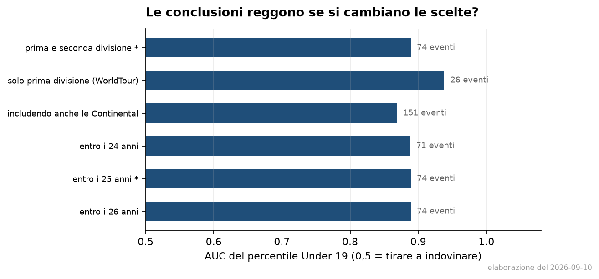

*Il numero di professionisti cambia da ventisei a centocinquantuno a seconda di come li si definisce, ma la capacità del rendimento giovanile di distinguerli resta quasi la stessa. L'asterisco indica la scelta dello studio.*

### Un modello più complicato farebbe meglio?

È l'obiezione più prevedibile: con dati longitudinali su migliaia di persone, una foresta casuale non troverebbe di più? La prova si fa sulle **stesse partizioni** — entrambi i modelli vedono gli stessi dati di addestramento e vengono misurati sugli stessi dati di verifica — e la foresta riceve tutte le celle invece di una sola, quindi parte avvantaggiata.

| modello | predittori | auc media | deviazione standard |
|---|---|---|---|
| parametrico (pct_U19y2 + coorte) | 2 | 0,933 | 0,002 |
| foresta casuale (17 predittori) | 17 | 0,953 | 0,004 |

*n = 2 813 · validazione incrociata a 5 parti, ripetuta 5 volte sulle stesse partizioni per entrambi i modelli*

**Guadagna +0,020 di AUC, con 15 predittori in più.** Il guadagno è costante fra le ripetizioni, ma non è un confronto a parità di informazione — il paragrafo qui sotto dice perché — e in ogni caso è piccolo: un modello con due parametri cattura quasi tutto quello che c'è da catturare. È l'argomento a favore della parsimonia, verificato invece che affermato.

Anche il modo in cui la foresta usa i dati è istruttivo. In cima alla sua classifica di importanza c'è proprio il percentile Under 19, che è l'unico predittore del modello parametrico; al secondo posto il numero di stagioni corse, che questo studio esclude di proposito perché è un mediatore — chi va meglio resta di più. **Parte del piccolo vantaggio della foresta viene dall'usare una variabile che il modello parametrico rifiuta per ragioni di interpretazione, non di prestazione.**

| variabile | importanza (riduzione di impurità) |
|---|---|
| pct_U19y2 | 31,05 |
| n_seasons_youth | 18,29 |
| pct_U23y1 | 17,83 |
| pct_U19y1 | 16,08 |
| pct_U17y2 | 11,93 |
| rel_age | 11,13 |

*diagnostica, non spiegazione causale: serve a vedere se la foresta usi informazione che il modello parametrico sta ignorando*

### E se si usassero tutte le categorie insieme?

La foresta casuale risponde alla domanda «più complicato serve?» con un modello che nessuno saprebbe interpretare. C'è un modo più diretto: mettere **tutte** le categorie dentro una regressione sola e lasciare che una penalizzazione decida quali tenere. Se le categorie portassero informazione distinta, ne sopravviverebbero diverse.

> **Come si misura — Elastic net**
>
> Una regressione con una penalità sui coefficienti, che li tira verso zero e ne azzera alcuni del tutto. La forza della penalità si sceglie per validazione incrociata, nella versione conservativa: la più forte il cui errore resta entro una deviazione standard dal minimo, cioè il modello più parsimonioso fra quelli sostanzialmente equivalenti al migliore.
>
> Mescola due penalità: quella che restringe tutti i coefficienti e quella che ne azzera alcuni. Con predittori correlati come le categorie giovanili la miscela è più stabile, perché evita che il metodo scelga a caso una fra due variabili quasi identiche.
>
> Da un modello penalizzato **non si leggono p-value**: i coefficienti sono distorti verso zero per costruzione. Si guarda quali variabili sopravvivono e quanto vale la previsione.
>
> Approfondimenti: [Elastic net](https://en.wikipedia.org/wiki/Elastic_net_regularization) · [Regolarizzazione](https://en.wikipedia.org/wiki/Regularization_(mathematics))

| variabile | odds ratio penalizzato | esito |
|---|---|---|
| U15y1 | — | azzerato |
| U15y2 | — | azzerato |
| U17y1 | — | azzerato |
| U17y2 | — | azzerato |
| U19y1 | — | azzerato |
| U19y2 | 1,17 | trattenuto |
| U23y1 | 1,06 | trattenuto |
| coorte | — | azzerato |

*n = 82 · elastic net a metà fra le due penalità, con lambda scelto per validazione incrociata nella versione conservativa; gli odds ratio sono distorti verso zero per costruzione e non vanno letti come stime*

**Sopravvivono 2 coefficienti su 8, e sono le due categorie più vicine al professionismo.** Tutte le altre vengono azzerate: una volta che si conosce il rendimento in U19y2, quello delle categorie precedenti non aggiunge abbastanza da giustificare il proprio posto nel modello.

E sulla previsione il guadagno è minimo: +0,015 di AUC rispetto al modello con la sola cella U19y2, sullo stesso sottocampione. È la terza volta che questo documento arriva alla stessa conclusione per tre strade diverse — modelli annidati, foresta casuale, penalizzazione — e conviene prenderla sul serio, ricordando però che non sono tre prove indipendenti: annidati e penalizzazione girano su quasi lo stesso sottocampione, e solo la foresta vede tutti gli atleti. Detto questo: **quasi tutta l'informazione utile sta nell'ultima misura disponibile.**

*Con una riserva che vale più del risultato.* Il modello richiede tutte le categorie osservate sullo stesso atleta, e restano **82 atleti su 2 813**, fra cui 40 professionisti: circa la metà del sottocampione. Su un gruppo così piccolo e così selezionato le AUC non sono confrontabili con nessun altro numero del documento, e l'azzeramento delle prime categorie potrebbe in parte riflettere la scarsità di dati più che la loro inutilità. Resta che va nella stessa direzione di tutto il resto.

> **Come vanno lette le AUC di questa sezione.** Alcune sono calcolate su tutta la coorte, codificando l'assenza dalla classifica come una categoria, e sono perciò più alte di quelle delle sezioni precedenti, che girano sui soli atleti presenti. Non vanno messe a confronto fra sezioni: qui conta la **stabilità** dei numeri fra una variante e l'altra, non il loro livello.
